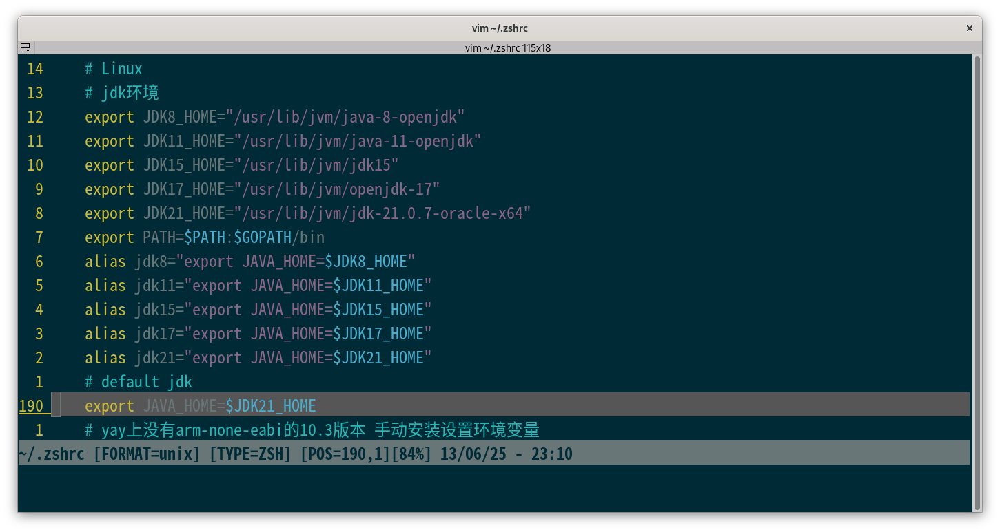
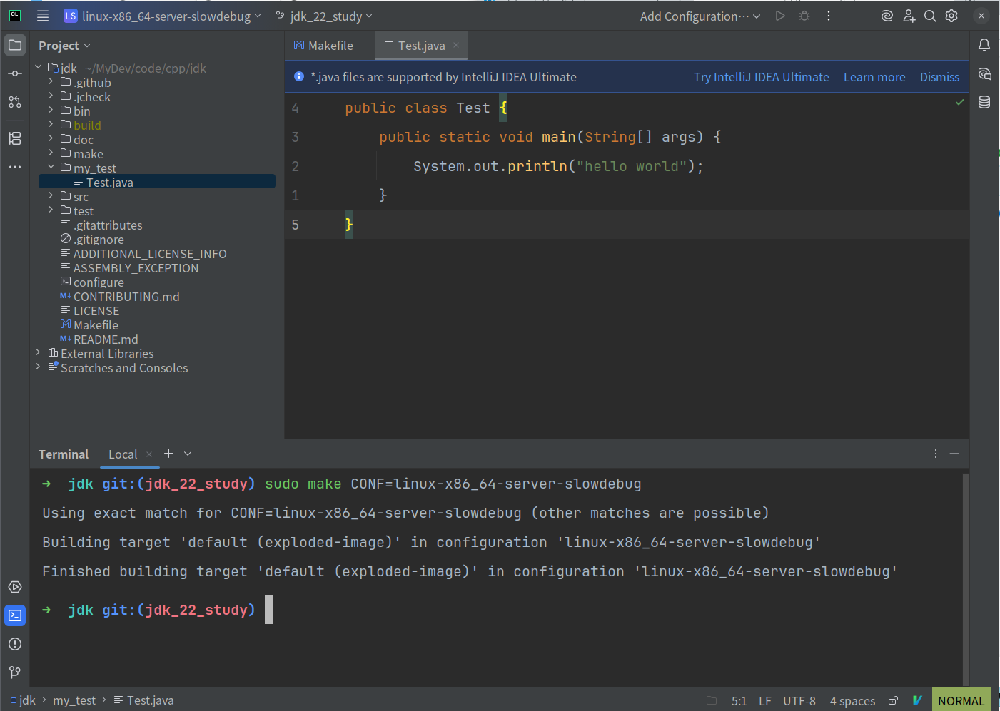

之前在mac上编译的openjdk源码，两个原因促使我要在Linux上操作一下

- mac机子老了，性能不行了，编译一次发烫厉害
- 一鼓作气，借着这个机会把以前没学的源码重拾

### 1 安装jdk21作为boot

[官网下个java21用作openjdk22的boot](https://www.oracle.com/cn/java/technologies/downloads/#java21)

```sh
mkdir -p MyApp/jdk/21
mv ~/MyDownload/jdk-21_linux-x64_bin.deb ~/MyApp/jdk/21
cd MyApp/jdk/21
sudo apt install ./jdk-21_linux-x64_bin.deb
dpkg -l|grep jdk
java -version
dpkg -L jdk-21
```

在zsh中修改一下对应环境变量



### 2 下载源码

```sh
git clone git@github.com:Bannirui/jdk.git
cd jdk
git remote add upstream git@github.com:openjdk/jdk.git
git remote set-url --push upstream no_push
git remote -v
git checkout jdk_22_study
```

### 3 生成make脚本

先安装依赖

```sh
sudo apt install autoconf
sudp apt install zip
sudo apt-get install libasound2-dev
sudo apt-get install libcups2-dev
sudo apt-get install libfontconfig1-dev
sudo apt-get install libx11-dev libxext-dev libxrender-dev libxrandr-dev libxtst-dev libxt-dev
```

```sh
bash ./configure \
--with-debug-level=slowdebug \
--with-jvm-variants=server \
--with-freetype=bundled \
--with-boot-jdk=/usr/lib/jvm/jdk-21.0.7-oracle-x64 \
--with-target-bits=64 \
--disable-warnings-as-errors \
--with-extra-cxxflags="-std=c++14"
```

看下build目录下生成的conf名称

```sh
linux-x86_64-server-slowdebug
```

### 4 编译

```sh
make CONF=linux-x86_64-server-slowdebug compile-commands
sudo make CONF=linux-x86_64-server-slowdebug
./build/linux-x86_64-server-slowdebug/jdk/bin/java --version
```

