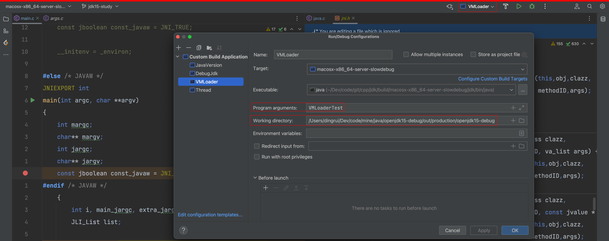
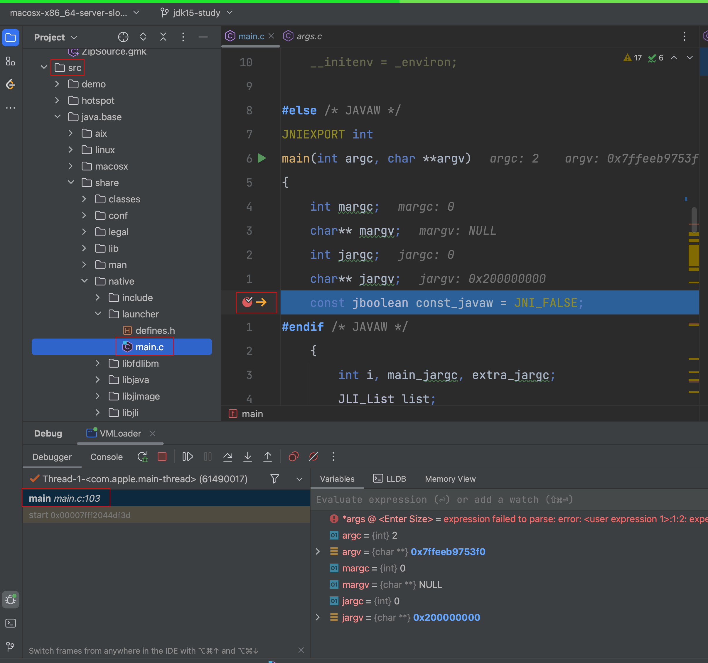
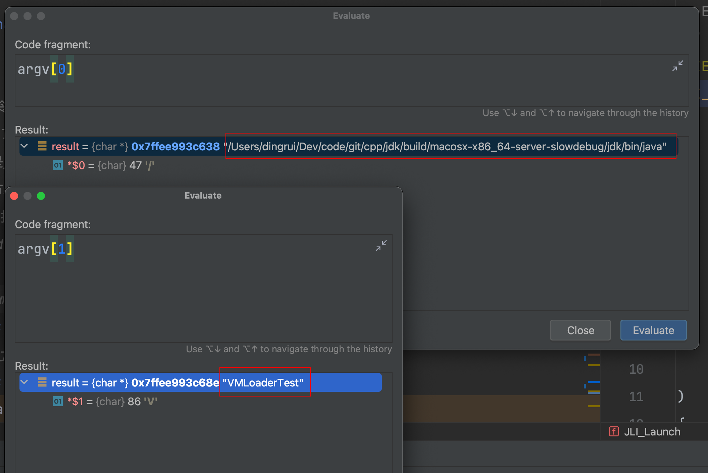
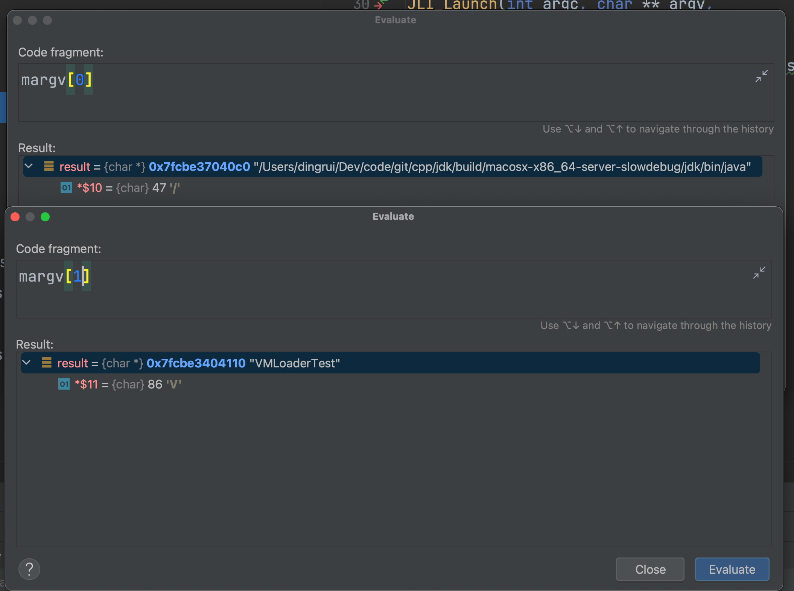

### 1 定位jdk的入口

#### 1.1 全局搜索main方法

我对c\cpp的了解还停留在语言语法层面，对工程构建并不熟悉，因此只能使用原始的方式。

下个断点，然后启动Java进程再根据调用栈往回精确定位。


#### 1.2 启动Java进程



代码就一行，只要能让Java进程运行起来，停在断点就行。

```java
public class VMLoaderTest {

    public static void main(String[] args) {
        System.out.println("HELLO WORLD");
    }
}
```

#### 1.3 调用栈

从线程调用栈可以看出来1.1搜索出来的就是Jdk源码的入口main方法所在之处。

即src/java.base/share/native/launcher/main.c。



### 2 main方法

#### 2.1 场景

指定一个明确的启动场景，方便更直观地理解代码流程。

从1.2中可以知道写了一个叫VMLoaderTest.java的源码单文件，然后通过javac命令将其编译为字节码文件，该Java类为VMLoaderTest。

然后通过java命令执行该该类的main方法，完整命令为``java VMLoaderTest``。

而编译好的`java`可执行文件放在哪儿取决于编译的设置，比如我的路径是`build/macosx-x86_64-server-slowdebug/jdk/bin/java`。

#### 2.2 启动参数

```c
JNIEXPORT int
main(int argc, char **argv)
{
    /**
     * 通过java命令执行javac编译好的Java字节码
     * 即VMLoaderTest.java经过javac编译好的类是VMLoaderTest
     * 比如执行的是java VMLoaderTest
     * 那么这个地方main方法接收到的是2个参数
     *   - java可执行文件全路径
     *   - VMLoaderTest
     */
    int margc;
    char** margv;
    int jargc;
    char** jargv;
    const jboolean const_javaw = JNI_FALSE;
```



#### 2.2 解析启动参数

没有在启动参数中指定预处理可选项的时候，解析出来的就是main方法的启动参数。

```c
 {
        // accommodate the NULL at the end
        // 长度3的数组
        JLI_List args = JLI_List_new(argc + 1);
        int i = 0;

        // Add first arg, which is the app name
        // 数组首元素就是编译好的java可执行文件全路径
        JLI_List_add(args, JLI_StringDup(argv[0]));
        // Append JDK_JAVA_OPTIONS
        if (JLI_AddArgsFromEnvVar(args, JDK_JAVA_OPTIONS)) { // 从环境变量中加载键JDK_JAVA_OPTIONS对应的值放到列表args里面 没有配置这个环境变量这个分支不执行
            // JLI_SetTraceLauncher is not called yet
            // Show _JAVA_OPTIONS content along with JDK_JAVA_OPTIONS to aid diagnosis
            if (getenv(JLDEBUG_ENV_ENTRY)) {
                char *tmp = getenv("_JAVA_OPTIONS");
                if (NULL != tmp) {
                    JLI_ReportMessage(ARG_INFO_ENVVAR, "_JAVA_OPTIONS", tmp);
                }
            }
        }
        // Iterate the rest of command line
        for (i = 1; i < argc; i++) {
            JLI_List argsInFile = JLI_PreprocessArg(argv[i], JNI_TRUE);
            if (NULL == argsInFile) { // 将VMLoaderTest放到args中 其实就是为了将来JVM初始化好回调到Java类中的main方法
                JLI_List_add(args, JLI_StringDup(argv[i]));
            } else {
                int cnt, idx;
                cnt = argsInFile->size;
                for (idx = 0; idx < cnt; idx++) {
                    JLI_List_add(args, argsInFile->elements[idx]);
                }
                // Shallow free, we reuse the string to avoid copy
                JLI_MemFree(argsInFile->elements);
                JLI_MemFree(argsInFile);
            }
        }
        margc = args->size; // main方法实际的启动参数
        // add the NULL pointer at argv[argc]
        JLI_List_add(args, NULL); // args数组中最后一个脚标占位了null
        margv = args->elements;
    }
```

#### 2.3 调用JLI_Launch

```c
/**
 * 当启动执行Java时没有指定启动参数和可选项时
 * 即默认的方式 java xxx
 * 调用JLI_Launch的参数就是main方法的启动参数
 *   - margc=2
 *   - margv
 *     - /Users/dingrui/Dev/code/git/cpp/jdk/build/macosx-x86_64-server-slowdebug/jdk/bin/java
 *     - VMLoaderTest
 *   - jargc=0
 *
 * pname标识的是program name
 * lname标识的是launcher name
 * 这2个是通过宏指定的
 *   - pname->java
 *   - lname->openjdk
 */
    return JLI_Launch(margc, margv,
                   jargc, (const char**) jargv,
                   0, NULL,
                   VERSION_STRING,
                   DOT_VERSION,
                   (const_progname != NULL) ? const_progname : *margv,
                   (const_launcher != NULL) ? const_launcher : *margv,
                   jargc > 0,
                   const_cpwildcard, const_javaw, 0);
```



