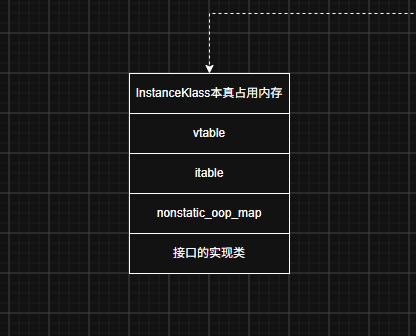

内存布局情况

```cpp
  // InstanceKlass本身占用的内存空间
  static int header_size()            { return sizeof(InstanceKlass)/wordSize; }

  /**
   * 普通Java类型的内存布局
   *   - InstanceKlass本身占用的内存
   *   - vtable
   *   - itable
   *   - nonstatic_oop_map
   *   - 接口的实现类
   * @param vtable_length vtable占用的内存空间
   * @param itable_length itable占用的内存空间
   * @param nonstatic_oop_map_size OopMapBlock占用的内存空间
   * @param is_interface
   */
  static int size(int vtable_length, int itable_length,
                  int nonstatic_oop_map_size,
                  bool is_interface) {
    return align_metadata_size(header_size() +
           vtable_length +
           itable_length +
           nonstatic_oop_map_size +
           (is_interface ? (int)sizeof(Klass*)/wordSize : 0));
  }
```



InstanceKlass总共有3个直接派生子类

- 
- 
- 