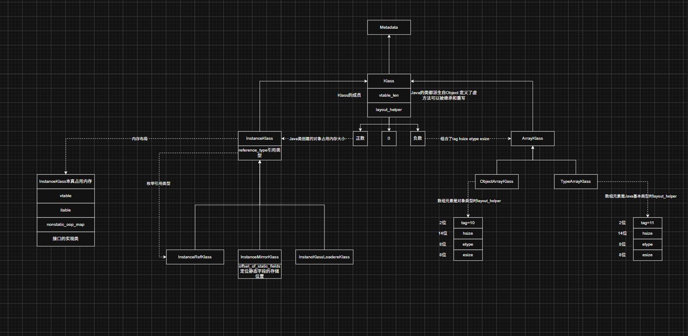

它是继承自，是所有数组类的抽象基类

```cpp
  // 数组的维度 比如int[][][]的维度就是3
  int      _dimension;         // This is n'th-dimensional array.
  // 数组的多维转换不单单是高维度到低维度 也需要低维度到高维度 所以每个维度都维护了两个指针 指向更高维度和更低维度 每个维度就像用双向链表串起来一样
  Klass* volatile _higher_dimension;  // Refers the (n+1)'th-dimensional array (if present).
  Klass* volatile _lower_dimension;   // Refers the (n-1)'th-dimensional array (if present).
```



从ArrayKlass的类图知道有两个子类

## 1 TypeArrayKlass表示数组组件类型是Java基本类型

### 1.1 max_length

```cpp
  // 数组允许的最大长度是多少
  jint _max_length;            // maximum number of elements allowed in an array
```

### 1.2 数组类的特点

数组类和普通类不同，数组类没有对应的Class文件，因此数组类是虚拟机直接创建的

Hotspot VM在初始化的时候就会创建Java中8个基本类型的一维数组实例TypeArrayKlass

见调用链是怎么执行到`create_klass`函数的

### 1.3 构造TypeArrayKlass对象

```cpp
/**
 * 给Java基本类型创建TypeArrayKlass实例
 * @param type 哪种Java基本类型
 */
TypeArrayKlass* TypeArrayKlass::create_klass(BasicType type,
                                      const char* name_str, TRAPS) {
  // 在Hotspot中 所有的字符串都是用Symbol实例表示的 以达到重用的目的
  Symbol* sym = nullptr;
  if (name_str != nullptr) {
    sym = SymbolTable::new_permanent_symbol(name_str);
  }

  // 用系统类加载器加载数组类型
  ClassLoaderData* null_loader_data = ClassLoaderData::the_null_class_loader_data();
  // 创建TypeArrayKlass并完成部分属性的初始化
  TypeArrayKlass* ak = TypeArrayKlass::allocate(null_loader_data, type, sym, CHECK_NULL);

  // Call complete_create_array_klass after all instance variables have been initialized.
  // 初始化TypeArrayKlass中的属性
  complete_create_array_klass(ak, ak->super(), ModuleEntryTable::javabase_moduleEntry(), CHECK_NULL);

  // Add all classes to our internal class loader list here,
  // including classes in the bootstrap (null) class loader.
  // Do this step after creating the mirror so that if the
  // mirror creation fails, loaded_classes_do() doesn't find
  // an array class without a mirror.
  null_loader_data->add_class(ak);
  JFR_ONLY(ASSIGN_PRIMITIVE_CLASS_ID(ak);)
  return ak;
}
```

#### 1.3.1 创建实例

```cpp
TypeArrayKlass* TypeArrayKlass::allocate(ClassLoaderData* loader_data, BasicType type, Symbol* name, TRAPS) {
  assert(TypeArrayKlass::header_size() <= InstanceKlass::header_size(),
      "array klasses must be same size as InstanceKlass");

  // TypeArrayKlass实例要占用的内存是多大
  int size = ArrayKlass::static_size(TypeArrayKlass::header_size());
  // 重载new运算符为对象分配内存
  return new (loader_data, size, THREAD) TypeArrayKlass(type, name);
}
```

#### 1.3.2 属性初始化

```cpp
// 初始化TypeArrayKlass中的属性
void ArrayKlass::complete_create_array_klass(ArrayKlass* k, Klass* super_klass, ModuleEntry* module_entry, TRAPS) {
  k->initialize_supers(super_klass, nullptr, CHECK);
  // 初始化vtable
  k->vtable().initialize_vtable();

  // During bootstrapping, before java.base is defined, the module_entry may not be present yet.
  // These classes will be put on a fixup list and their module fields will be patched once
  // java.base is defined.
  assert((module_entry != nullptr) || ((module_entry == nullptr) && !ModuleEntryTable::javabase_defined()),
         "module entry not available post " JAVA_BASE_NAME " definition");
  oop module = (module_entry != nullptr) ? module_entry->module() : (oop)nullptr;
  // 初始化了java.lang.Class对象中静态字段的值 这样静态字段就可以正常使用了
  java_lang_Class::create_mirror(k, Handle(THREAD, k->class_loader()), Handle(THREAD, module), Handle(), Handle(), CHECK);
}
```

涉及到两个流程

- vtable是怎么初始化的 
- 基本类型的mirror值Class对象创建 

## 2 ObjArrayKlass表示数组组件类型是对象类型

它的属性用途是判断数组元素是类还是数组

### 2.1 属性

```cpp
  // 数组的组件类型 不是元素类型
  Klass* _element_klass;            // The klass of the elements of this array type
  // 数组的元素类型 可以是InstanceKlass或者TypeArrayKlass 因此可能是元素类型也可能是TypeArrayKlass
  // 一维基本类型的数组用TypeArrayKlass表示
  // 二维基本类型数组用ObjArrayKlass表示 它的bottom_klass是TypeArrayKlass
  Klass* _bottom_klass;             // The one-dimensional type (InstanceKlass or TypeArrayKlass)
```