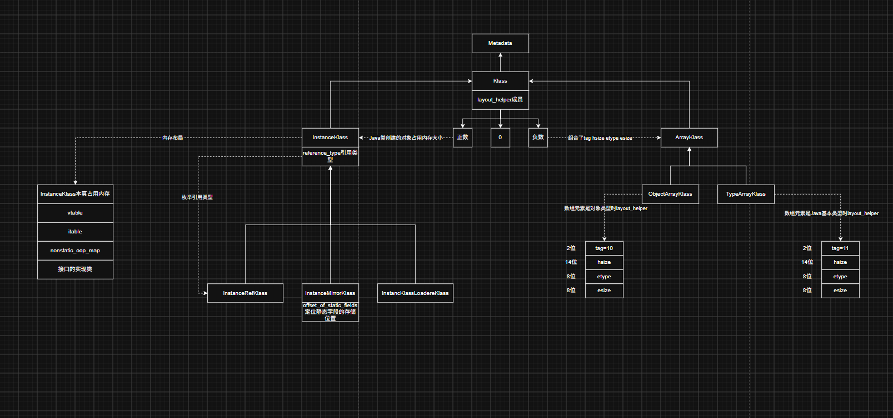

这个类实例表示特殊的java.lang.Class类，这个类新增了一个静态属性用来保存静态字段的起始偏移量



## 1 Java类的静态字段存储

```cpp
  // Klass表示Java类 oop表示Java对象 Java类可能定义了非静态字段 也可能定义了静态字段
  // 非静态字段存储在oop中
  // 静态字段存储在当前Java类的java.lang.Class对象中 而Class的类型就用的是InstanceMirrorKlass这个Klass表示
  // 这个字段用来定位静态字段的存储位置
  static int _offset_of_static_fields;
```

## 2 怎么计算

```cpp
  // 初始化offset_of_static_fields属性
  static void init_offset_of_static_fields() {
    // Cache the offset of the static fields in the Class instance
    assert(_offset_of_static_fields == 0, "once");
    // Java类创建对象占用的内存多少个字节 oop后面紧跟着就开始存储静态字段的值 所以能定位到静态字段存储在什么位置上
    _offset_of_static_fields = InstanceMirrorKlass::cast(vmClasses::Class_klass())->size_helper() << LogHeapWordSize;
  }
```