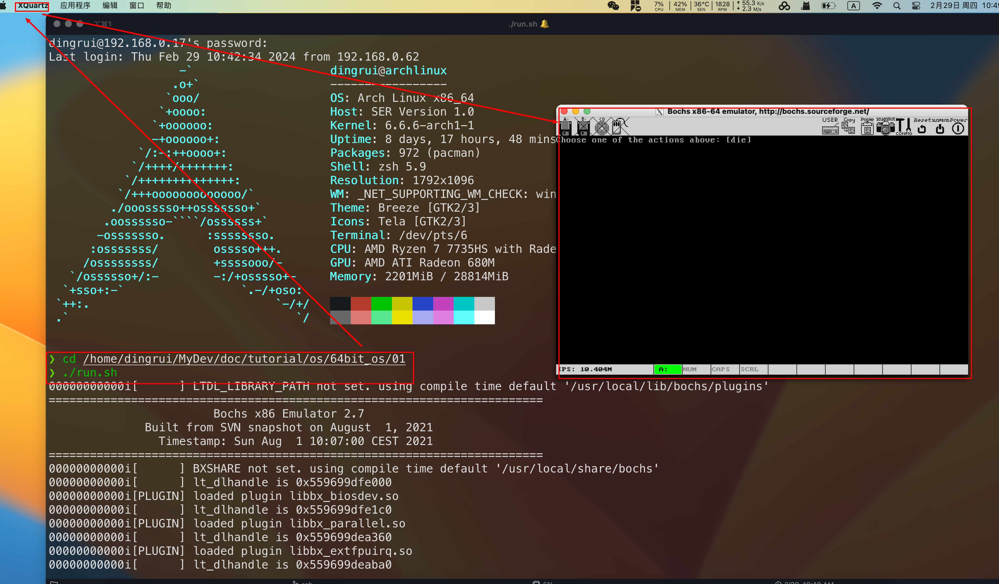

### 1 archlinux服务端配置

#### 1.1 配置文件

文件`/etc/ssh/ssh_config`放开如下两行注释


#### 1.2 重启ssh

```shell
sudo systemctl restart ssh
```

### 2 mac客户端配置

#### 2.1 配置文件

文件`/private/etc/ssh/ssh_config`放开如下注释


#### 2.2 安装XQuartz

[XQuartz官网](https://www.xquartz.org/)

下载安装即可，安装好后会进行重启

```shell
ssh -X dingrui@archlinux
```

但是有一说一，这个gui做的是真丑，一看就是各种字符或者编解码支持得不够友好


#### 2.3 iterm2支持x11

不得不说mac上最好用的终端是iTerm2，最好用的shell是zsh

##### 2.3.1 xquartz中添加命令指向iterm2


##### 2.3.2 iterm2使用gui

之前介绍过怎么在iterm2中配置ssh连接，

再不需要手动`ssh -X 用户名@远程ip`的方式，直接打开一个ssh的窗口运行即可


在iterm2中运行的程序需要gui支持会自动转发x11给xquartz，唤起xquartz，然后显示出来

