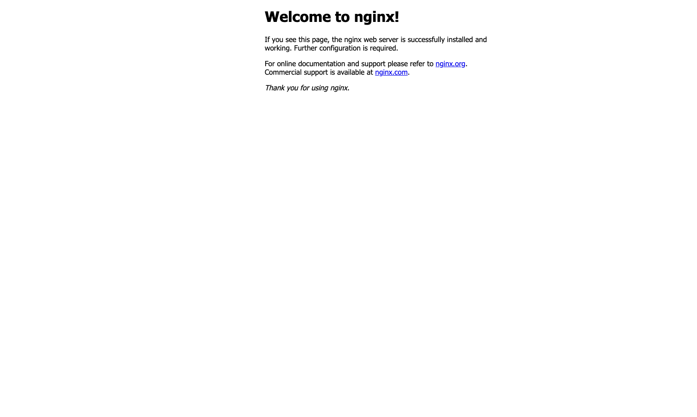

### 1 下载源码

```sh
git clone git@github.com:Bannirui/nginx.git
cd ngix
git remote add upstream git@github.com:nginx/nginx.git
git remote set-url --push upstream no_push
git remote -v
git fetch upstream
git checkout master
git rebase upstream/master
git checkout -b my_study
```

### 2 前置依赖

#### 2.1 brew安装

```sh
brew install pcre openssl
```

#### 2.2 源码安装zlib

[从官网下载源码](https://zlib.net/)

```sh
mkdir -p ~/MyApp/zlib
cp ~/Downloads/zlib-1.3.1.tar.gz ./
tar -zxvf ./zlib-1.3.1.tar.gz
```

那么zlib的home路径为`/Users/dingrui/MyApp/zlib/zlib-1.3.1`

### 3 配置编译选项

```sh
bash ./auto/configure \
  --prefix=/usr/local/nginx \
  --with-pcre \
  --with-zlib=/Users/dingrui/MyApp/zlib/zlib-1.3.1 \
  --with-openssl=/opt/homebrew/Cellar/openssl@3/3.4.1
```

### 4 编译

```sh
make
```

### 5 安装

```sh
sudo make install
```

然后在上面`prefix`指定的路径下可以看到可执行文件`/usr/local/nginx/nginx`

### 6 启动

配置文件在`/usr/local/nginx/conf`下，就用默认的配置就行

```sh
sudo /usr/local/nginx/sbin/nginx
```

服务默认监听在80端口



为了在IDea中阅读代码，要简单配置一下开发环境