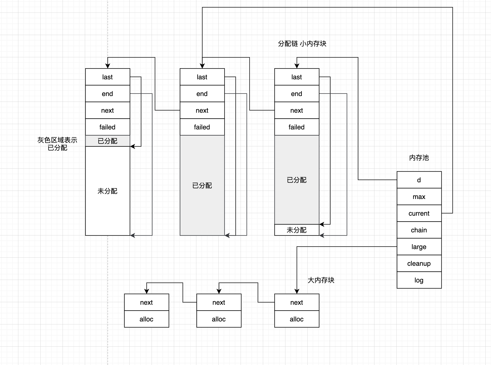

首先看nginx中内存池的示意图


### 1 内存池结构
```c
/**
 * 内存池的头部结构
 * 为啥要分小/大内存块
 * <ul>
 *   <li>小内存块要去看剩下的空间够不够使用需求的 减少内存碎片</li>
 *   <li>大内存块是直接分配的 虽然可能存在一些内存浪费 但是都使用大内存了 为了检索效率肯定用空间换时间</li>
 * </ul>
 * 大小=32+8+8+8+8+8+8=80byte
 */
struct ngx_pool_s {
    /**
     * 分配链
     * 内存池的内存块链表 小内存块
     * 内存布局的小设计 报ngx_pool_data_t放在最前面 p为内存池地址 以后就可以用p->d->next->d->next方式遍历内存块
     */
    ngx_pool_data_t       d;
    /**
     * 内存中内存块有两种规格 小内存块和大内存块
     * 这个值取决于内核页大小和实例化内存池指定的大小
     * 创建内存池指定的大小(约等于小内存块大小)=内存池头+小内存块头+内存块可分配大小
     * 内存池实例化的时候就决定好这个属性了 以此界定要申请的空间属性小内存还是大内存
     * <ul>
     *   <li>小内存就从分配链的小内存块上开辟 不足就新建内存块挂到分配链上</li>
     *   <li>大内存就新建大内存块挂到大内存块链表上</li>
     * </ul>
     */
    size_t                max;
    /**
     * 内存池正在使用的内存块 小内存块
     * 这个current是作用就是指向每次分配内存从哪个内存块开始遍历看看内存块有没有可用空间可以分配出去 current滑动的机制靠内存块分配失败计数
     * 为什么要设计这个 遍历的时候直接从链表头开始不就行了
     * <ul>
     *   <li>每次分配内存都从内存池的分配链开始遍历链表 这个方案当然可行 但是弊端也是显而易见 可能存在的情况是内存块分配满了 没有可用空间 但是每次都要被遍历 明显的性能损耗</li>
     *   <li>避免浪费轮询的机制就是不要每次都从链表头开始 而是从一个大概率可以分配成功的内存块开始遍历链表</li>
     * </ul>
     */
    ngx_pool_t           *current;
    ngx_chain_t          *chain;
    /*
     * 大内存块链表
     */
    ngx_pool_large_t     *large;
    ngx_pool_cleanup_t   *cleanup;
    ngx_log_t            *log;
};
```

### 2 小内存块
```c
/**
 * 内存池中数据块链表节点 小数据块 管理当前数据块的在内存池中划分的内存区域
 * 一个内存中有分为很多内存块 用链表形式组织
 * <ul>
 *   <li>内存池内 小内存块</li>
 *   <li>内存池外 大内存块</li>
 * </ul>
 * 大小=8+8+8+4=28byte->32byte
 */
typedef struct {
    /**
     * 内存块可分配内存区域的地址位置
     * 内存块中有连续内存 可能不是全部使用 而只是使用了其中一部分
     * last指向可分配的起始地址
     */
    u_char               *last;
    /**
     * 指向内存块可分配的最后地址
     * 也就是说[last...end)是可分配部分
     */
    u_char               *end;
    /**
     * 链表的next域 下一个内存块
     */
    ngx_pool_t           *next;
    /**
     * 内存块的分配失败次数
     * 什么叫分配失败
     * 就是内存池分配内存时要在内存块上找满足需求大小的内存块进行内存分配 当所有内存块都开辟不出来空间给需求时 就需要新建内存块了 这种情况就判定为一次内存分配失败
     * 找内存的时候是找了[current....)所有内存块 那么没个内存块分配失败计数都要+1
     * 这个计数的意义是设定一个阈值4 当current的分配次数超过4次 内存池的current就要易主
     */
    ngx_uint_t            failed;
} ngx_pool_data_t;
```

### 3 大内存块
```c
// 内存池中大块内存链表形式
struct ngx_pool_large_s {
    // 链表的next域
    ngx_pool_large_t     *next;
    // 实际用来存储数据的内存
    void                 *alloc;
};
```

### 4 实例化内存池
```c
/**
 * @param size 创建内存池会预分配个内存块 size=内存池头+预分配的内存块大小
 */
ngx_pool_t *
ngx_create_pool(size_t size, ngx_log_t *log)
{
    ngx_pool_t  *p;

    /*
     * 申请内存 对齐边界是16Byte 申请好的内存用途是
     * <ul>
     *   <li>组织内存池头 管理整个内存池</li>
     *   <li>抠掉内存池头 剩下空间作为首个内存块</li>
     * </ul>
     */
    p = ngx_memalign(NGX_POOL_ALIGNMENT, size, log);
    if (p == NULL) {
        return NULL;
    }
    // 内存池的头部已经被使用了 可以使用的部分在头部后面 抠掉头部剩下的空间作为一个内存块 最为链表节点挂到内存池的分配链上
    // 内存块的可分配空间[last...end)
    p->d.last = (u_char *) p + sizeof(ngx_pool_t);
    p->d.end = (u_char *) p + size;
    // 创建内存池时只分配了一个内存块 因此分配链上就一个链表节点
    p->d.next = NULL;
    // 初始化内存块分配失败次数 初始值0
    p->d.failed = 0;

    /*
     * 首个内存块大小作为每次向内存池申请的空间大小阈值
     * <ul>
     *   <li>系统调用alloc系列的限制跟内核有关 默认4KB</li>
     *   <li>内存池可以突破这个限制</li>
     *   <li>以此为分水岭 大于这个的是大内存块 小于这个的是小内存块
     *     <ul>
     *       <li>小内存块开辟是</li>
     *       <li></li>
     *     </ul>
     *   </li>
     * </ul>
     */
    size = size - sizeof(ngx_pool_t);
    /*
     * 内存池每次向请求分配空间大小限制
     * 以后申请的内存大小<ul>
     *   <li>1 小内存从小内存块分配 没有可用内存了再分配新的小内存块</li>
     *   <li>2 大内存直接分配大内存块</li>
     * </ul>
     */
    p->max = (size < NGX_MAX_ALLOC_FROM_POOL) ? size : NGX_MAX_ALLOC_FROM_POOL;
    // 内存池当前使用的小内存块
    p->current = p;
    p->chain = NULL;
    // 初始化内存当时不分配大内存块 懒加载 需要的时候再分配
    p->large = NULL;
    p->cleanup = NULL;
    p->log = log;

    return p;
}
```

### 5 内存池分配内存
内存池创建好是为了使用，所以理解源码的最好方式是看内存池是如何分配内存的。
```c
/**
 * 从内存池申请内存 内存对齐
 * 根据内存池设定的max阈值看要分配的内存给大内存块管理还是小内存块管理
 * <ul>
 *   <li>大内存块直接新建大内存块作为链表节点挂到大内存块链表上</li>
 *   <li>小内存块的话 先看看内存池分配链上小内存块有没有可分配空间了
 *     <ul>
 *       <li>有现成空间就直接使用</li>
 *       <li>没有空间就从系统开辟空间 实例化新的小内存块作为分配链节点挂到小内存块链表上</li>
 *     </ul>
 *   </li>
 * </ul>
 * @param pool 内存池
 * @param size 要申请的空间
 * @return 分配的内存地址
 */
void *
ngx_palloc(ngx_pool_t *pool, size_t size)
{
#if !(NGX_DEBUG_PALLOC)
    /*
     * 分配小内存
     */
    if (size <= pool->max) {
        return ngx_palloc_small(pool, size, 1);
    }
#endif
    // 大块内存
    return ngx_palloc_large(pool, size);
}
```

### 6 小内存块分配内存
#### 6.1 小内存块有足够空间
```c
/**
 * 内存池分配小内存
 * <ul>
 *   <li>1 遍历分配链上的内存块 看看内存块上可分配内存够不够用 遍历的内存块不是整个分配链 而是current及之后的内存块</li>
 *   <li>2 没有可用内存块就新分配内存块</li>
 * </ul>
 * @param pool 内存池
 * @param size 分配的内存空间
 * @param align 标识是不是需要内存对齐 0-不需要对齐
 * @return 分配的内存地址
 */
static ngx_inline void *
ngx_palloc_small(ngx_pool_t *pool, size_t size, ngx_uint_t align)
{
    u_char      *m;
    /*
     * 得益于ngx_pool_s的内存布局 最前面放置的是ngx_pool_data_t
     * 因此这个地方p实际是ngx_pool_data_t类型 用来遍历内存池的内存块
     */
    ngx_pool_t  *p;
    // 内存池正在使用的内存块
    p = pool->current;

    /*
     * 从内存池正在使用的内存块开始遍历内存池的内存块
     * 找到了够分配内存的内存块就在内存块上分配
     */
    do {
        // 内存块可分配的内存空间起始地址
        m = p->d.last;

        // 控制内存对齐
        if (align) {
            // 保证内存块中可分配内存的内存对齐
            m = ngx_align_ptr(m, NGX_ALIGNMENT);
        }
        // 内存块上可分配空间足够需求 在当前内存块上分配内存
        if ((size_t) (p->d.end - m) >= size) {
            // 在内存块上分配size的空间 调整内存块可分配大小[last...end)
            p->d.last = m + size;

            return m;
        }
        p = p->d.next;

    } while (p);
    /*
     * 执行到这两种情况
     * <ul>
     *   <li>1 数据块都没有可分配内存了 也就是所有数据块都分配完了</li>
     *   <li>2 数据块有碎片 数据块虽然有可分配内存 但是不满足需求大小</li>
     * </ul>
     * 那就要在内存池中分配个新的内存块 小内存块
     */
    return ngx_palloc_block(pool, size);
}
```
#### 6.2 分配小内存块
```c
/**
 * 分配内存块 小内存块
 * 因为内存池分配内存时发现内存不足 这时要给内存池新加内存块
 * @param pool 内存池
 * @param size 向内存池申请的内存大小
 * @return 内存池分配的内存地址
 */
static void *
ngx_palloc_block(ngx_pool_t *pool, size_t size)
{
    u_char      *m;
    size_t       psize;
    ngx_pool_t  *p, *new;

    // 内存块大小 计算一个内存块是多大 准备新建个内存块挂到内存池的分配链上
    psize = (size_t) (pool->d.end - (u_char *) pool);
    // 向操作系统申请内存用作内存块
    m = ngx_memalign(NGX_POOL_ALIGNMENT, psize, pool->log);
    if (m == NULL) {
        return NULL;
    }

    // 新的内存块
    new = (ngx_pool_t *) m;
    // 初始化内存块的可分配信息 [last...end)是可分配的
    new->d.end = m + psize;
    new->d.next = NULL;
    // 初始化内存块的分配失败次数 初始化0
    new->d.failed = 0;
    // 抠掉内存块的头占用的大小
    m += sizeof(ngx_pool_data_t);
    // 确保内存对齐
    m = ngx_align_ptr(m, NGX_ALIGNMENT);
    // 要从内存池里面抠掉size空间
    new->d.last = m + size;

    /**
     * 从内存池正在使用的内存块开始遍历分配链上的内存块
     * 现在的流程是在分配内存块 能触发分配内存块 肯定是从内存池分配内存时发现内存池分配链[current...)上内存块都不可用
     * 也就意味着分配链上[current....)内存块都发生了一次分配失败
     */
    for (p = pool->current; p->d.next; p = p->d.next) {
        /*
         * 内存块分配内存失败无非就两种情况
         * <ul>
         *   <li>内存块真的不剩下空间了</li>
         *   <li>内存块剩了点空间 几乎不足以大部分场景需求了</li>
         * </ul>
         * 内存块分配失败次数超过4 就判定为内存块分配满了 没有可用空间了 即使真的存在浪费可能性也无所谓了 典型用空间换时间 避免链表轮询的性能消耗
         * 这个地方滑动current也比较巧妙
         * 本质是当前current的分配失败次数超限 滑动current到下一个内存块
         * 但是更新失败次数面向的内存块是[current...) 可能后面内存块分配次数也超限了 也就是新的current也不合格
         * 因此直接在更新计数的过程中考察每一个内存块 次数超限就后移current
         */
        if (p->d.failed++ > 4) {
            pool->current = p->d.next;
        }
    }

    // 上面for循环结束后p指向的就是内存池分配链上最后一个内存块 链表尾插
    p->d.next = new;

    return m;
}
```

### 7 大内存块分配内存
大内存的管理就简单了，因为内存偏大，大内存一方面使用频率就不高，再者内存宝贵，因此不需要考虑在内存池中的复用
- 需要的时候就向系统申请
- 用完就释放归还给系统
```c
/**
 * 申请内存池大块内存
 * <ul>
 *   <li>1 在池外申请好内存</li>
 *   <li>2 用内存池管理大块内存</li>
 * </ul>
 * @param pool 内存池实例
 * @param size 要申请的内存空间
 * @return 申请到的内存地址
 */
static void *
ngx_palloc_large(ngx_pool_t *pool, size_t size)
{
    void              *p;
    ngx_uint_t         n;
    ngx_pool_large_t  *large;

    // 向系统申请内存
    p = ngx_alloc(size, pool->log);
    if (p == NULL) {
        return NULL;
    }

    n = 0;

    for (large = pool->large; large; large = large->next) {
        if (large->alloc == NULL) {
            large->alloc = p;
            return p;
        }
        // 小细节 如果链表过长 找4个还没挂载上去 就头插一个
        if (n++ > 3) {
            break;
        }
    }
    /*
     * 执行到这无非两种情况
     * <ul>
     *   <li>1 大块内存链表节点都名花有主 要新增节点</li>
     *   <li>2 链表过长 为了执行效率没有尾插 采用头插</li>
     * </ul>
     */
    large = ngx_palloc_small(pool, sizeof(ngx_pool_large_t), 1);
    if (large == NULL) {
        ngx_free(p);
        return NULL;
    }
    // 链表头插
    large->alloc = p;
    large->next = pool->large;
    pool->large = large;

    return p;
}
```

### 8 内存池的重置
内存池的意义在于
- 减少系统调用alloc/free系统
- 提高执行效率
- 增加内存的复用
关于复用，本质是内存空间的复用，形式又包括
- 内存池的结构，辛辛苦苦实例化好的内存池结构，用的时候实例化，不用了就销毁也无可厚非，但是如果能一个实例化，多次使用就是对内存的复用
- 内存池中的大内存块复用其结构，真正执行的数据内存区域还是直接根据内核交换，随用随还
- 小内存块通过指针动态管理分配状态，简单移动指针就可以复位/调整内存块分配状态
```c
/**
 * 内存池重置
 * <ul>
 *   <li>小内存块逻辑回收 调整可分配内存状态就行 不用真的释放这部分内存</li>
 *   <li>大内存块保留头部结构 释放指向的内存</li>
 * </ul>
 * @param pool 内存池
 */
void
ngx_reset_pool(ngx_pool_t *pool)
{
    ngx_pool_t        *p;
    ngx_pool_large_t  *l;

    /*
     * 遍历大内存块链表 释放大内存块上记录的分配出去的内存
     * 保留内存块头部结构
     */
    for (l = pool->large; l; l = l->next) {
        if (l->alloc) {
            ngx_free(l->alloc);
        }
    }

    /*
     * 遍历分配链上小内存块
     * 不需要真的释放内存块内存
     * <ul>
     *   <li>分配链有现成的内存块结构 再给释放了 回头真用到分配内存时还得消耗性能新建内存块</li>
     *   <li>内存块里面可分配内存也不需要真的回收 只要重置状态就行 继续重复使用</li>
     * </ul>
     */
    for (p = pool; p; p = p->d.next) {
        /*
         * 这个地方我猜测是空间换时间 但是没必要
         * <ul>
         *   <li>首先内存池结构体大小80byte 内存块结构体32byte 相差不小</li>
         *   <li>其次遍历链表单独判断链表首节点并不会有很多的性能损耗</li>
         *   <li>无非就是代码简洁性牺牲了</li>
         * </ul>
         * 对nginx提交的issue https://github.com/nginx/nginx/issues/555
         */
        p->d.last = (u_char *) p + sizeof(ngx_pool_t);
        // 内存块分配失败计数重置为0
        p->d.failed = 0;
    }

    // 重置内存池的current
    pool->current = pool;
    pool->chain = NULL;
    pool->large = NULL;
}
```

### 9 回收内存池
当整个内存池使用完毕需要回收时
```c
/**
 * 释放内存池
 */
void
ngx_destroy_pool(ngx_pool_t *pool)
{
    ngx_pool_t          *p, *n;
    ngx_pool_large_t    *l;
    ngx_pool_cleanup_t  *c;

    for (c = pool->cleanup; c; c = c->next) {
        if (c->handler) {
            ngx_log_debug1(NGX_LOG_DEBUG_ALLOC, pool->log, 0,
                           "run cleanup: %p", c);
            c->handler(c->data);
        }
    }

    /*
     * 遍历大内存块链表 释放大内存块上指向的内存
     * 为什么只回收了大内存块中实际存放数据的内存 而不管大内存块头部结构
     * 因为大内存块的头部当初就是开辟在小内存块上的 只要下面把所有小内存块都释放掉就自然而然释放了所有有内存块内存
     */
    for (l = pool->large; l; l = l->next) {
        if (l->alloc) {
            ngx_free(l->alloc);
        }
    }

    // 遍历分配链上小内存块 释放小内存块
    for (p = pool, n = pool->d.next; /* void */; p = n, n = n->d.next) {
        ngx_free(p);

        if (n == NULL) {
            break;
        }
    }
}
```