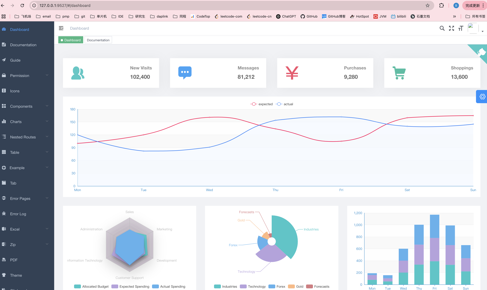

以vue项目为例打包为dist目录

### 1 拷贝dist
将整个dist目录拷贝到`/usr/local/Cellar/nginx/1.27.4/html`下，重命名为vue_element_admin

### 2 修改conf文件
修改`/usr/local/etc/nginx`下nginx.conf文件

```conf
    # 添加vue_element_admin服务
    server {
        # 服务端口
        listen       9527;
        # 域名
        server_name  localhost;
        # 服务
        location / {
            # 服务器的默认网站根目录位置
            root   html/vue_element_admin;
            # 定义路径下默认访问的文件名 也就是请求localhost:9527就会访问html/vue_element_admin/index.html
            index  index.html index.htm;
        }
        error_page   500 502 503 504  /50x.html;
        location = /50x.html {
            root   html;
        }
    }
```

### 3 重启nginx服务
```sh
brew services restart nginx
```

### 4 访问服务
浏览器访问`http://localhost:9527`
