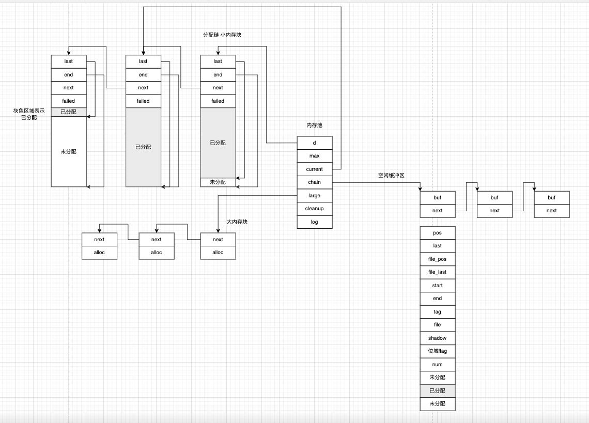

### 1 缓冲区结构
```c
/*
 * 缓冲区
 */
struct ngx_buf_s {
    /*
     * 缓冲区当前数据的起始位置
     */
    u_char          *pos;
    /*
     * 缓冲区当前数据的结束位置
     */
    u_char          *last;
    off_t            file_pos;
    off_t            file_last;

    /*
     * buf缓冲区起始位置
     */
    u_char          *start;         /* start of buffer */
    /*
     * buf缓冲区结束位置
     */
    u_char          *end;           /* end of buffer */
    ngx_buf_tag_t    tag;
    ngx_file_t      *file;
    ngx_buf_t       *shadow;


    /*
     * c语言默认整数类型是int
     * int的前11位
     */
    /* the buf's content could be changed */
    /*
     * 1标识缓冲区数据可以修改
     */
    unsigned         temporary:1;

    /*
     * the buf's content is in a memory cache or in a read only memory
     * and must not be changed
     */
    unsigned         memory:1;

    /* the buf's content is mmap()ed and must not be changed */
    unsigned         mmap:1;

    unsigned         recycled:1;
    unsigned         in_file:1;
    unsigned         flush:1;
    unsigned         sync:1;
    unsigned         last_buf:1;
    unsigned         last_in_chain:1;

    unsigned         last_shadow:1;
    unsigned         temp_file:1;

    /* STUB */ int   num;
};
```
### 2 内存池空闲缓冲区

### 3 实例化缓冲区
```c
/*
 * 实例化一个缓冲区
 * @param size buf的大小
 */
ngx_buf_t *
ngx_create_temp_buf(ngx_pool_t *pool, size_t size)
{
    ngx_buf_t *b;

    // 从内存池申请buf结构的内存
    b = ngx_calloc_buf(pool);
    if (b == NULL) {
        return NULL;
    }
    // 分配缓冲区内存 记录缓冲区的起始位置
    b->start = ngx_palloc(pool, size);
    if (b->start == NULL) {
        return NULL;
    }
    // 缓冲区刚创建好 还没填充数据 数据是空的
    b->pos = b->start;
    b->last = b->start;
    // 缓冲区结束位置
    b->end = b->last + size;
    // 标识缓冲区的数据是可以修改的
    b->temporary = 1;

    return b;
}
```
### 4 批量创建缓冲区
```c
/*
 * 从内存池分配多个缓冲区并挂成链表
 * @param pool 内存池
 * @param bufs 需要分配多少个缓冲区 每个缓冲区多大
 * @return 缓冲区挂成链表
 */
ngx_chain_t *
ngx_create_chain_of_bufs(ngx_pool_t *pool, ngx_bufs_t *bufs)
{
    u_char       *p;
    ngx_int_t     i;
    ngx_buf_t    *b;
    ngx_chain_t  *chain, *cl, **ll;
    // 所有缓冲区需要所有内存一次性分配
    p = ngx_palloc(pool, bufs->num * bufs->size);
    if (p == NULL) {
        return NULL;
    }

    ll = &chain;

    for (i = 0; i < bufs->num; i++) {
        // 缓冲区结构
        b = ngx_calloc_buf(pool);
        if (b == NULL) {
            return NULL;
        }
        // 初始化缓冲区
        // 缓冲区中数据是空的
        b->pos = p;
        b->last = p;
        // 标识缓冲区数据可修改
        b->temporary = 1;
        // 缓冲区起始位置
        b->start = p;
        // 一大片内存中抠掉分配完的缓冲区 剩下来继续分配给其他缓冲区
        p += bufs->size;
        // 缓冲区结束位置
        b->end = p;
        // 缓冲区链表节点
        cl = ngx_alloc_chain_link(pool);
        if (cl == NULL) {
            return NULL;
        }
        // 初始化缓冲区链表的节点
        cl->buf = b;
        *ll = cl;
        ll = &cl->next;
    }

    *ll = NULL;

    return chain;
}
```
### 5 缓冲区归类空闲缓冲区
```c
/*
 * 归类待处理缓冲区 要么被处理成正在使用缓冲区要么被处理成空闲缓冲区
 * 空闲缓冲区统一管理在内存池的空闲缓冲区链表上
 * @param p
 * @param free 空闲缓冲区
 * @param busy 正在使用的缓冲区
 * @param out 待处理的缓冲区
 * @param tag
 */
void
ngx_chain_update_chains(ngx_pool_t *p, ngx_chain_t **free, ngx_chain_t **busy,
    ngx_chain_t **out, ngx_buf_tag_t tag)
{
    ngx_chain_t  *cl;
    // 遍历待处理缓冲区 把所有待处理缓冲区先整成正在使用的缓冲区
    if (*out) {
        if (*busy == NULL) {
            *busy = *out;

        } else {
            for (cl = *busy; cl->next; cl = cl->next) { /* void */ }

            cl->next = *out;
        }

        *out = NULL;
    }
    /*
     * 遍历正在使用缓冲区
     */
    while (*busy) {
        cl = *busy;

        if (cl->buf->tag != tag) {
            *busy = cl->next;
            // 缓冲区放到内存池空闲链表供复用
            ngx_free_chain(p, cl);
            continue;
        }
        // 缓冲区中有数据
        if (ngx_buf_size(cl->buf) != 0) {
            break;
        }
        // 缓冲区中没数据 重置缓冲区状态到初始状态
        cl->buf->pos = cl->buf->start;
        cl->buf->last = cl->buf->start;

        *busy = cl->next;
        // 当前缓冲区被回收了 头插到空闲链表上
        cl->next = *free;
        *free = cl;
    }
}
```
