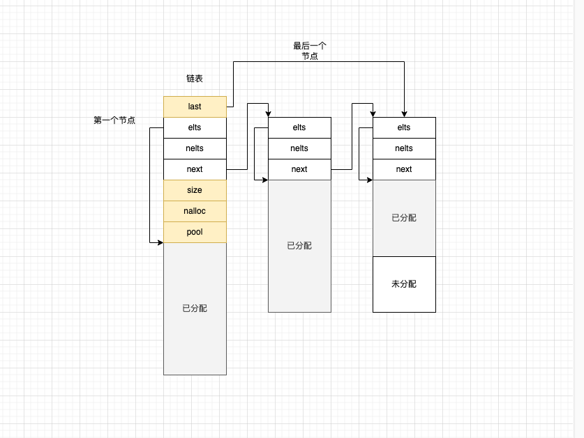

### 1 结构图

### 2 链表实例化
```c
/*
 * 实例化链表
 * 虽然是链表 在创建链表时知道已知要放n个元素 这n个元素大小作为一个链表节点要存放多少个元素
 * @param pool 内存池
 * @param n 一个链表节点要放多少个元素
 * @param size 一个元素多大
 * @return 链表
 */
ngx_list_t *
ngx_list_create(ngx_pool_t *pool, ngx_uint_t n, size_t size)
{
    ngx_list_t  *list;
    // 链表结构
    list = ngx_palloc(pool, sizeof(ngx_list_t));
    if (list == NULL) {
        return NULL;
    }
    // 初始化链表
    if (ngx_list_init(list, pool, n, size) != NGX_OK) {
        return NULL;
    }

    return list;
}
```
### 3 链表初始化化
```c
/*
 * 链表初始化
 * @param list 实例化好的链表
 * @param pool 内存池
 * @param n 一个链表节点的元素容量 一个链表节点存放多少个元素
 * @param size 一个元素大小
 * @return 操作状态码
 */
static ngx_inline ngx_int_t
ngx_list_init(ngx_list_t *list, ngx_pool_t *pool, ngx_uint_t n, size_t size)
{
    // 给链表节点分配内存存放数据
    list->part.elts = ngx_palloc(pool, n * size);
    if (list->part.elts == NULL) {
        return NGX_ERROR;
    }
    // 链表上已经存放的元素个数 还没放数据
    list->part.nelts = 0;
    list->part.next = NULL;
    list->last = &list->part;
    list->size = size;
    list->nalloc = n;
    list->pool = pool;

    return NGX_OK;
}
```
### 4 向链表添加元素
```c
/*
 * 向链表中添加元素
 * @param l 链表
 * @return 调用方拿到内存地址负责写数据
 */
void *
ngx_list_push(ngx_list_t *l)
{
    void             *elt;
    ngx_list_part_t  *last;

    last = l->last;

    if (last->nelts == l->nalloc) {
        // 链表上最后一个节点已经满了 给链表新分配个新节点
        /* the last part is full, allocate a new list part */

        last = ngx_palloc(l->pool, sizeof(ngx_list_part_t));
        if (last == NULL) {
            return NULL;
        }
        // 分配用来存放数据的内存=一个链表容纳的元素个数*一个元素大小
        last->elts = ngx_palloc(l->pool, l->nalloc * l->size);
        if (last->elts == NULL) {
            return NULL;
        }
        // 新分配的节点还没放元素 元素数据是0
        last->nelts = 0;
        last->next = NULL;

        l->last->next = last;
        l->last = last;
    }
    // last指向的是最后一个有效节点 节点已经存放了nelts个元素 新元素入链表的内存地址
    elt = (char *) last->elts + l->size * last->nelts;
    last->nelts++;
    // 把存放新数据的内存地址交给调用方 让调用方把数据写到内存上去
    return elt;
}
```