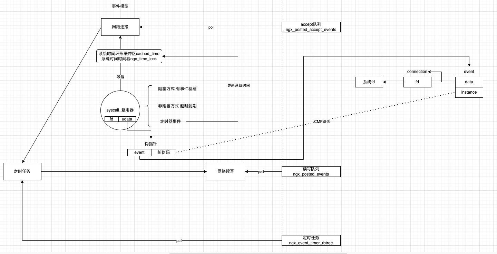

### 1 伪事件
什么是伪事件以及为什么会出现伪事件

- epoll中注册了个fd为7`epoll_ctl(efd, EPOLL_CTL_ADD, 7, EPOLLIN)`
- 事件触发，用户层处理了这个 fd，并关闭了它`close(7); // 用户关闭了 fd`
  - 此时epoll的内核红黑树里并没立即删除这个fd的记录
  - 这是epoll的缺陷 直到你手动epoll_ctl DEL
- 操作系统最小可用fd分配策略导致会复用fd 此时系统又分配了一个新的 socket也使用了fd=7
- 拿到新分配的fd又给注册到了epoll`epoll_ctl(efd, EPOLL_CTL_ADD, 7, EPOLLIN);`
- 这时候epoll中状态就已经乱了
  - epoll 现在监听的是新的 fd=7
  - 但它内部还残留着老的fd=7的状态和触发记录

至此如果没有判断机制就一直处理伪事件 顺序是
- epoll_wait返回伪事件
- 业务层调用read() 发现没数据而读失败
- 又注册回epoll
- epoll_wait又立刻触发这个fd
- 继而导致无限循环CPU飙升

这就是epoll空转问题

### 2 Netty中的优化
在这篇提过Netty对这个问题的优化方案，根据经验值计数判定重新注册事件。

### 3 Nginx中的方案
上面Netty中的方案采用的是曲线救国方式，用一点点的cpu负载代价来减少空转，并不能从根上解决问题。
而问题的根因是fd被系统复用了，因此只要能识别出fd是不是被复用就行了，一旦从复用器拿到的fd是被复用的就直接丢掉，不要继续往复用器注册就行。操作系统会有一个机制，那些没有被处理的伪事件会被从多路复用器中移除，也就是伪事件只有上一个连接，不会出现更早的连接。因此只要你能识别出谁是伪事件，不要再向复用器注册伪事件，就可以彻底解决伪事件的不良影响。

- 但是直观上判断系统的fd有没有被复用是没办法做到的
- nginx抽象了几个结构体
  - nginx_event_s 事件
  - nginx_connection_s 连接
- 事件分为读写两个 event:connection:fd=2:1:1



换言之fd跟event是可以互相回溯的，二者是等价的，所以判断fd有没有被复用就变成了判断event跟fd之间的映射关系是不是正确的

比如
- event1对应fd1，fd1注册在复用器中
- 后来event1被close掉，fd1也归还给操作系统了，但是复用器中还没有删除fd1
- 重新向操作系统申请socket又分配了fd1
- 这个时候复用器被唤醒发现fd1事件到达
- 根据fd1映射event1，这个时候event1无非就两种情况
  - 1 上次被close掉后，这个event结构体地址再没被分配出去，所以此时状态还是close
  - 2 很巧，上次被close掉后，这个event结构体地址被分配出去了，此时根据fd1映射拿到event1的状态不是close，但是此时event1的instance值和写在复用器udata里面的instance值肯定是对不上的

```c
            /*
             * 读写事件的处理
             * <ul>
             *   <li>可读的触发条件
             *     <ul>
             *       <li>socket中有数据没有被读取</li>
             *       <li>文件 设备准备好可以读取</li>
             *       <li>连接被关闭 连接被关闭的时候会返回事件可读并且可读的data长度是0</li>
             *     </ul>
             *   </li>
             *   <li>可写的触发条件
             *     <ul>
             *       <li>socket写缓冲区中有数据</li>
             *       <li>文件描述符已就绪可写 但不表示对方一定能收完数据</li>
             *     </ul>
             *   </li>
             * </ul>
             */
            /*
             * 伪事件的防御设计
             * 在复用器kq的udata中存放的是一个变种地址
             * <ul>
             *   <li>指针后3位是0</li>
             *   <li>最低位被放上了翻转版本号</li>
             * </ul>
             * 所以拿到内核返回的udata
             * <ul>
             *   <li>只要把最低位抹成0就是真正的用户事件地址</li>
             *   <li>只解析最低位的1bit就是翻转版本号 防伪码</li>
             * </ul>
             */
            instance = (uintptr_t) ev & 1;
            ev = (ngx_event_t *) ((uintptr_t) ev & (uintptr_t) ~1);
            /*
             * 解决事件伪触发问题的体现
             * 这边有几个关注点
             * <ul>
             *   <li>1 防伪码为什么只要2种就行 也就是0和1翻转为什么可以达到验伪事件效果 为什么不需要考虑更久之前的连接</li>
             *   <li>2 event是nginx抽象的 在向复用器注册事件时翻转instance值 所谓反转就是上次是0这次就是1 上次是1这次就是0 所以nginx是怎么知道event上一次的instance值是多少的</li>
             * </ul>
             * 这两个问题
             * <ul>
             *   <li>第1个问题 是操作系统保证的 内核中过时事件的保留是短暂的 只会保留一次触发后没被消费掉的伪事件 之后会被清理或覆盖 也就是伪事件根本不会出现更早的连接 最多只有上一次的连接 所以nginx要做的事情就是不要把伪事件注册回复用器就行 识别出伪事件什么也不用做</li>
             *   <li>第2个问题 nginx中有内存池 所谓的连接关闭仅仅是在结构体标识位打上关闭标识然后把内存还给内存池 并没有真正把内存free给操作系统 所以下一次分配到的event地址里面就是上一次遗留的instance值</li>
             * </ul>
             * 操作系统的伪事件留存机制和nginx内存池设计一起作用 只要翻转instance就足够保证防御伪事件
             * event在内存池中 在上一次释放后 再拿到同一个event地址后 event状态无非就两种
             * <ul>
             *   <li>再没被分配出去 也就是没有被复用 它的状态还是close</li>
             *   <li>被分配出去了 也就是被复用了 它的状态不是close 所以要进行验证 看看是不是过期了 也就是伪事件</li>
             * </ul>
             */
            if (ev->closed || ev->instance != instance) {
                /*
                 * the stale event from a file descriptor
                 * that was just closed in this iteration
                 */

                ngx_log_debug1(NGX_LOG_DEBUG_EVENT, cycle->log, 0,
                               "kevent: stale event %p", ev);
                // 不用处理 操作系统自会回收清除没有被处理的伪事件
                continue;
            }
```