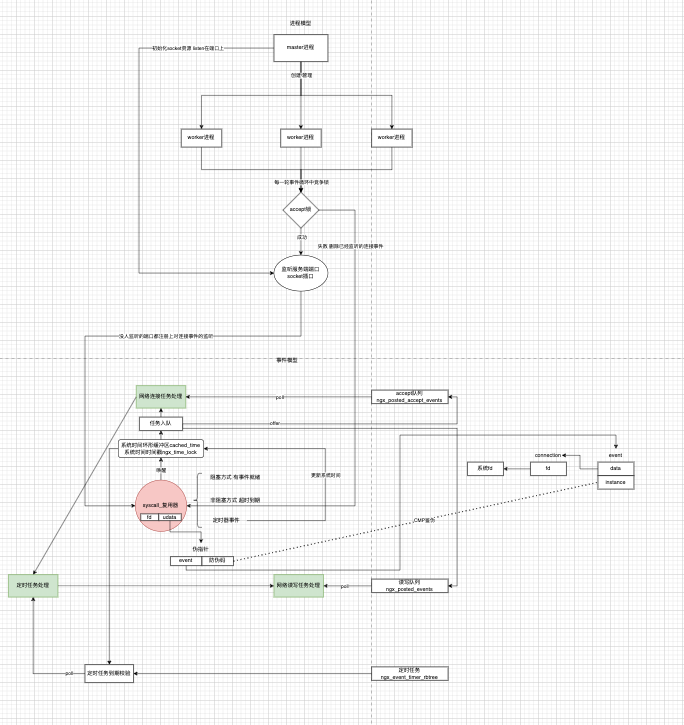

nginx为了性能，采用了多进程并行的方式。



### 1 进程模型

nginx有两种进程模式

- 单进程
- 多进程

单进程模型没有什么要说的，简单明了。多进程模式下，分为master进程和worker进程。

- master进程负责管理worker进程
- worker进程负责业务处理，主要就是事件循环

### 1 多进程开启

修改启动配置文件nginx.conf中进程模型的配置

```conf
# 控制进程模式 worker进程数量
# 1 单进程模式 只有一个worker进程
# n 多进程模式 master-worker进程模式
# auto 根据cpu核数定
worker_processes  1;
```

当然进程数肯定要合理设置，上限设置处理器核数就行，既能有并行效果，又避免进程切换开销。

### 2 怎么创建worker进程的

```c
/*
 * master创建worker子进程
 * 创建好子进程后 进程启动后的执行入口是ngx_worker_process_cycle方法 入参有两个cycle和i
 */
static void
ngx_start_worker_processes(ngx_cycle_t *cycle, ngx_int_t n, ngx_int_t type)
{
    ngx_int_t  i;

    ngx_log_error(NGX_LOG_NOTICE, cycle->log, 0, "start worker processes");

    for (i = 0; i < n; i++) {
		/*
		 * 创建子进程 子进程创建好后回调函数ngx_worker_process_cycle(cycle, i)
		 * cycle是nginx的全局变量 所有进程共享 主要要配置 master和worker都要用 所以在进程间作为参数传递
		 * i是0-based的整数 n个worker进程编号[0...n-1]
         */
        ngx_spawn_process(cycle, ngx_worker_process_cycle,
                          (void *) (intptr_t) i, "worker process", type);

        ngx_pass_open_channel(cycle);
    }
}
```

### 3 worker进程的执行流程

内核创建好新的进程后，会回调入口函数，让子进程执行流程进入到预期的逻辑。

```c
/*
 * worker进程运行逻辑
 * 子进程是由master进程创建的 创建好后会传两个参数
 * @param cycle nginx的全局变量
 * @param data 子进程的编号 0-based 假设有n个子进程 编号就是[0...n-1]
 */
static void
ngx_worker_process_cycle(ngx_cycle_t *cycle, void *data)
{
	// 子进程的编号
    ngx_int_t worker = (intptr_t) data;

    ngx_process = NGX_PROCESS_WORKER;
    ngx_worker = worker;
	// 初始化工作进程
    ngx_worker_process_init(cycle, worker);

    ngx_setproctitle("worker process");
    /*
     * 事件循环
     * <ul>
     *   <li>接收请求</li>
     *   <li>处理任务</li>
     * </ul>
     */
    for ( ;; ) {

        if (ngx_exiting) {
            if (ngx_event_no_timers_left() == NGX_OK) {
                ngx_log_error(NGX_LOG_NOTICE, cycle->log, 0, "exiting");
                ngx_worker_process_exit(cycle);
            }
        }

        ngx_log_debug0(NGX_LOG_DEBUG_EVENT, cycle->log, 0, "worker cycle");
        // 工作进程的事件循环
        ngx_process_events_and_timers(cycle);

        if (ngx_terminate) {
            ngx_log_error(NGX_LOG_NOTICE, cycle->log, 0, "exiting");
            ngx_worker_process_exit(cycle);
        }

        if (ngx_quit) {
            ngx_quit = 0;
            ngx_log_error(NGX_LOG_NOTICE, cycle->log, 0,
                          "gracefully shutting down");
            ngx_setproctitle("worker process is shutting down");

            if (!ngx_exiting) {
                ngx_exiting = 1;
                ngx_set_shutdown_timer(cycle);
                ngx_close_listening_sockets(cycle);
                ngx_close_idle_connections(cycle);
                ngx_event_process_posted(cycle, &ngx_posted_events);
            }
        }

        if (ngx_reopen) {
            ngx_reopen = 0;
            ngx_log_error(NGX_LOG_NOTICE, cycle->log, 0, "reopening logs");
            ngx_reopen_files(cycle, -1);
        }
    }
}
```

### 4 事件循环

不管是单进程模式还是多进程模式，最终的核心流程都是事件循环器工作。这一块的内容在。