1 linux主机服务端
---

### 1.1 sshd安装

- 查看sshd状态`systemctl status sshd`

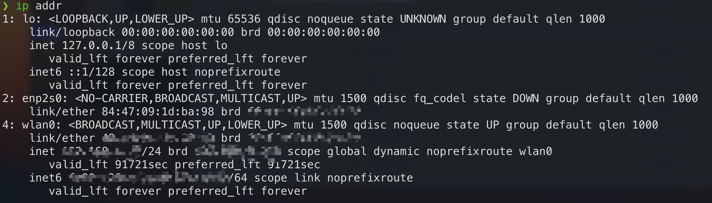

- 如果没有ssh服务端就进行安装和配置

  - 是否安装过`yay -Q |grep openssh`

  - 安装`yay -Syy openssh`

  - 启动`systemctl start sshd`

  - 开机自启动`systemctl enable ssh`

### 1.2 sshd配置

因为我不打算登陆root用户，所以没有修改配置文件`/etc/ssh/sshd-config`

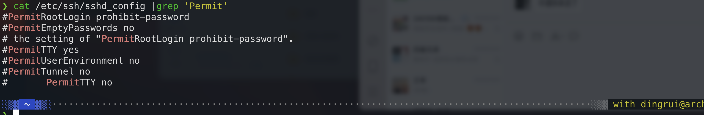

查看当前ssh服务器的ip地址`ip addr`

### 1.3 x11转发gui

简单的ssh可能不足以满足我的需求，我要通过ssh转发gui的数据，所以要配置服务端开启x11转发功能

文件`/etc/ssh/sshd_config`放开如下两行注释

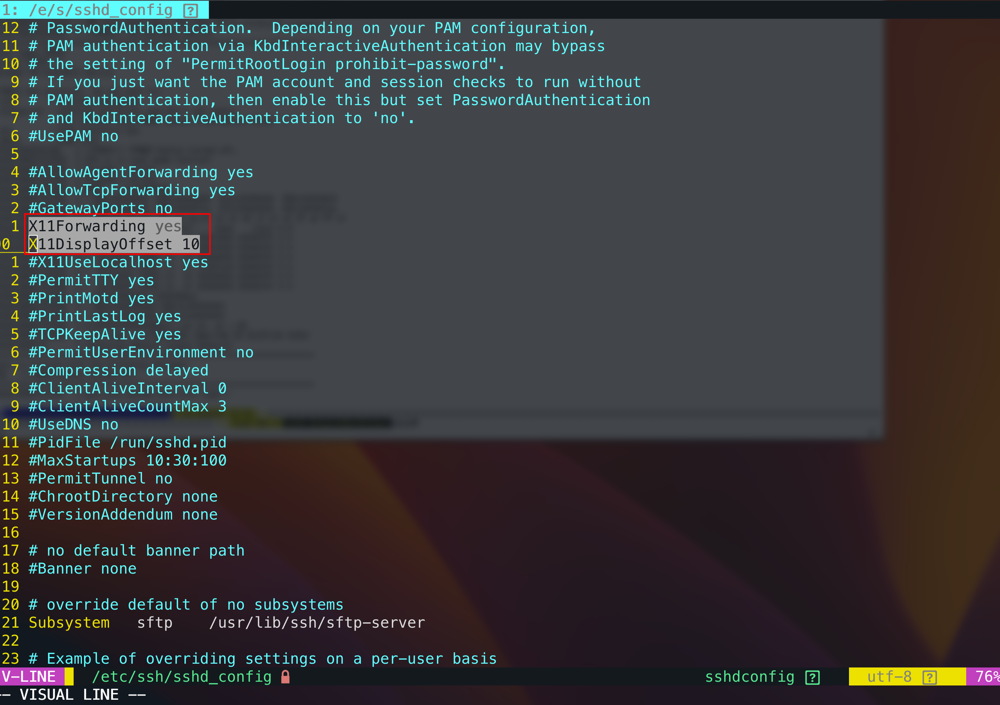

### 1.4 重启ssh

```shell
sudo systemctl restart ssh
```

### 1.5 重启服务器

```sh
reboot
```

2 mac本地客户端
---

### 2.1 手动连接

在终端输入`ssh 用户名@远程ip -p 22`即可，随后按照提示键入远程主机用户密码。

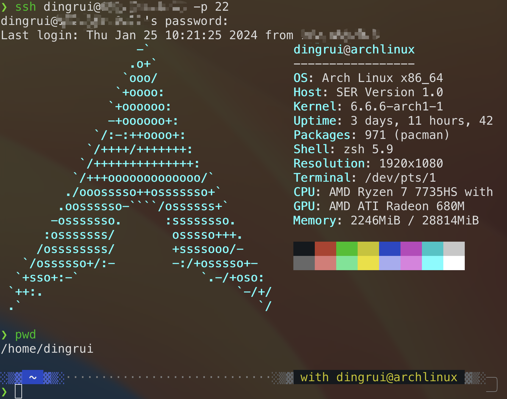


### 2.2 自动连接

上面的ssh命令连接方式很不友好，因此用iterm2终端配置

- 新建一个profile专门给ssh连接archlinux使用

- 指定command为`ssh -X 用户名@远程主机ip -p 22`

- 识别到`password:`后自动输入用户密码，切记在密码之后加上换行符

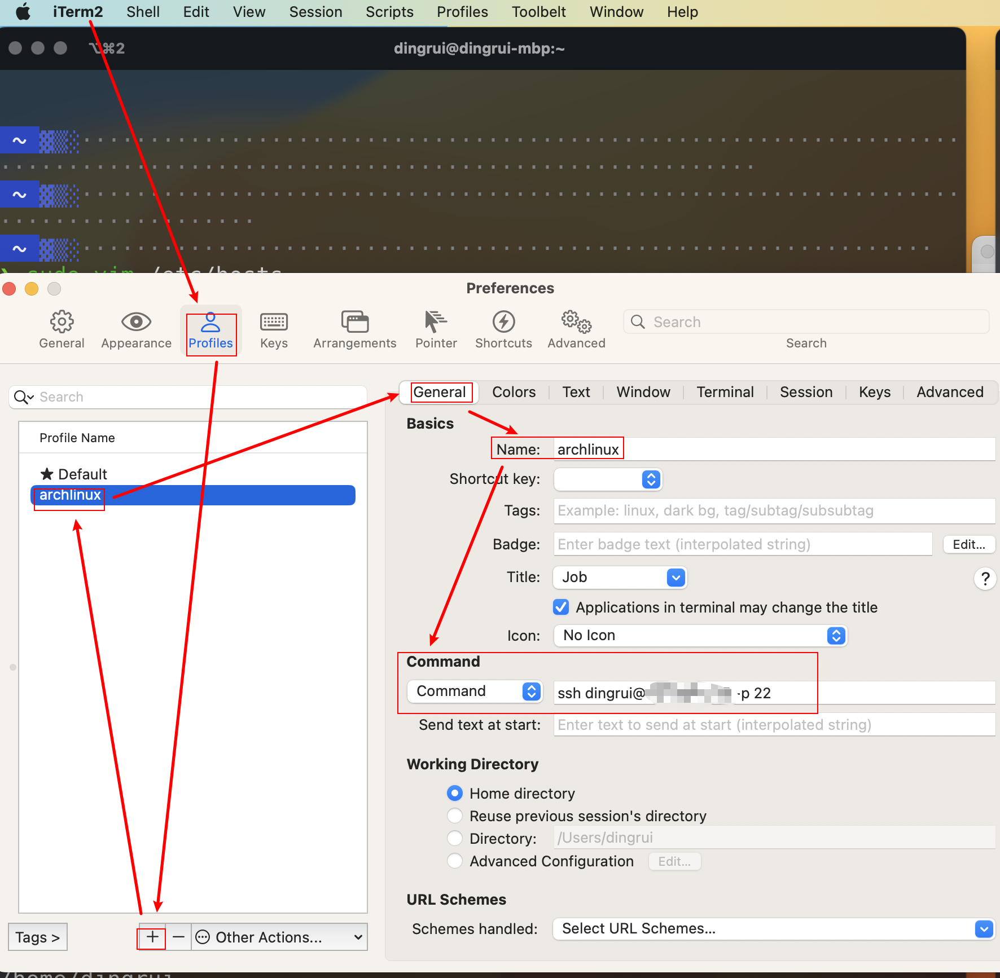

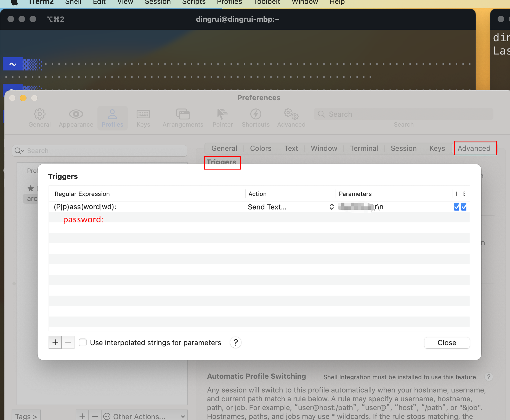

至此，便可以直接新建一个终端窗口直连远程主机

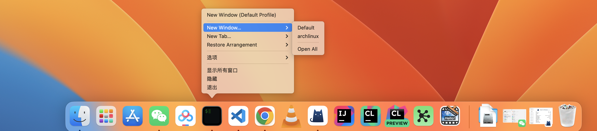

### 2.3 ssh配置

至此还是不够优雅

- 首先要记录ip地址

- 其次安全操作还要输入密码

所以为了解决这两个问题

#### 2.3.1 密钥创建和设置

首先要在本机`~/.ssh`目录下运行`ssh-keygen`生成密钥，文件名称我就取名为archlinux，用于mac连接远程archlinux

- archlinux 私钥 这个文件放在本地

- archlinux.pub 公钥 这个文件scp复制到远程archlinux的`~/.ssh`目录下重命名为authorized_keys

并且还要设置一下远程archlinux的`/etc/ssh/sshd_config`文件

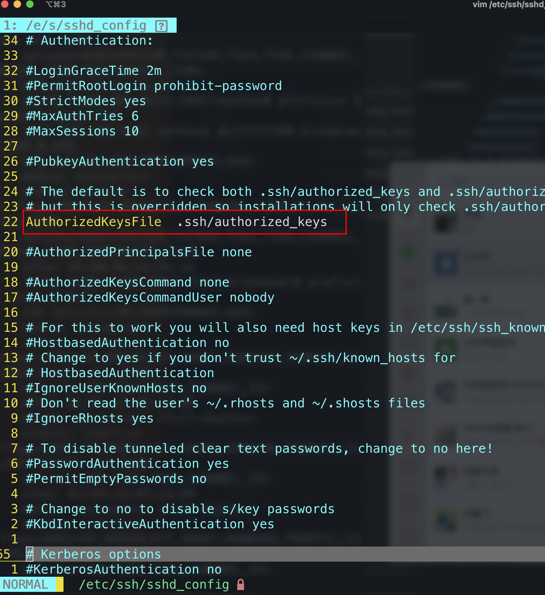

#### 2.3.2 config配置

文件`~/.ssh/config`文件

```sh
Host archlinux
	HostName 192.168.0.17
	User dingrui
    # 私钥路径
    # ssh dingrui@archlinux
    # 再执行ssh连接的时候就可以免密登陆了
    IdentityFile ~/.ssh/archlinux
```

#### 2.3.3 x11转发配置

我还要x11的转发配置，因此继续修改config配置

文件`~/.ssh/config`文件

```sh
# 远程archlinux 开启x11转发gui
Host archlinux
	HostName 192.168.0.17
	User dingrui
    # 私钥路径
    # ssh dingrui@archlinux
    # 再执行ssh连接的时候就可以免密登陆了
    IdentityFile ~/.ssh/archlinux
    ForwardX11 yes
    ForwardX11Trusted yes
    ForwardAgent yes
```

### 2.4 安装XQuartz

[XQuartz官网](https://www.xquartz.org/)

下载安装即可，安装好后会进行重启

```shell
ssh -X dingrui@archlinux
```

但是有一说一，这个gui做的是真丑，一看就是各种字符或者编解码支持得不够友好

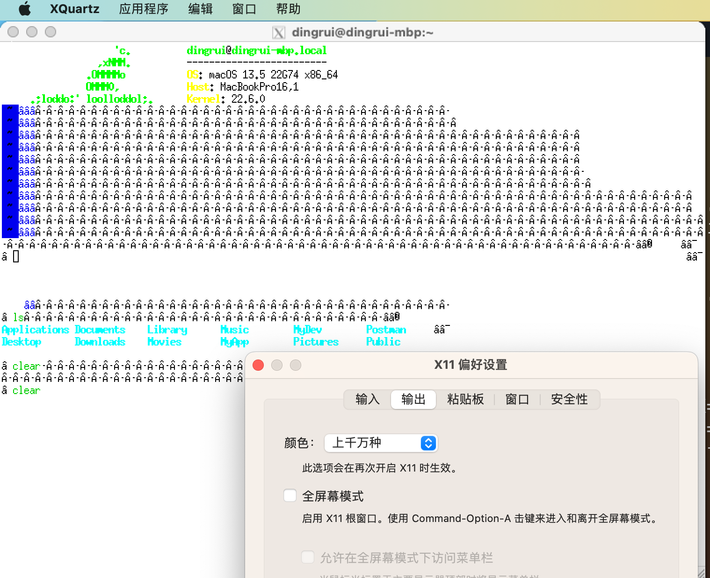

### 2.5 终端和shell支持x11转发

#### 2.5.1 iterm2支持x11

不得不说mac上最好用的终端是iTerm2，最好用的shell是zsh

##### 2.5.2 xquartz中添加命令指向iterm2

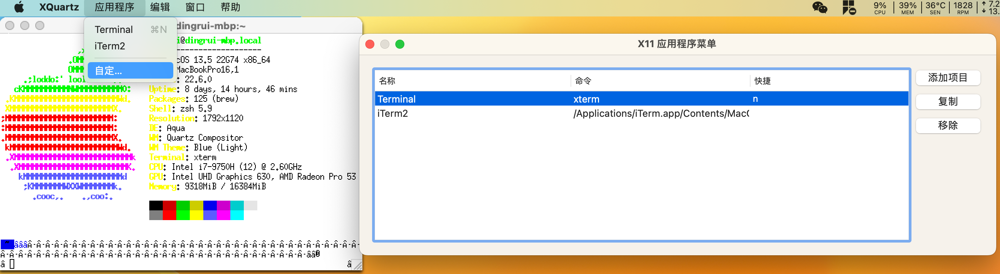

##### 2.5.3 iterm2使用gui

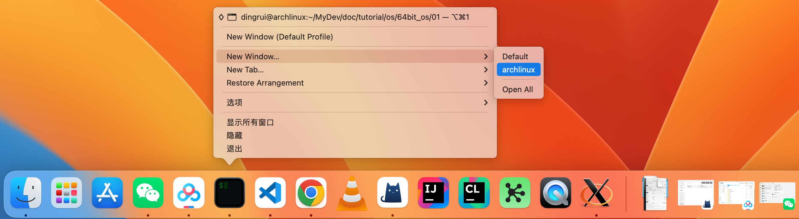

在iterm2中运行的程序需要gui支持会自动转发x11给xquartz，唤起xquartz，然后显示出来

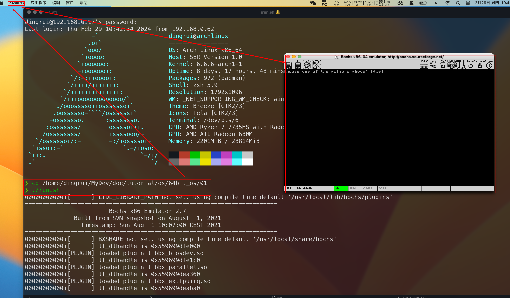

### 2.6 拷贝文件或文件夹

因为配置了`~/.ssh/config`的主机ip和hostname的映射，在使用scp的时候也不用指定ip了，直接指定主机名就行

||本机->远程|远程->本机|
|---|---|---|
|文件|scp 本机文件 dingrui@archlinux:远程路径|scp dingrui@archlinux:远程文件 本机路径|
|文件夹|scp -r 本机路径 dingrui@archlinux:远程路径|scp -r dingrui@archlinux:远程路径 本机路径|

3 OpenGL的支持
---

在ssh远程开发OpenGL的时候发现X11转发有问题，因此要配置VirtualGL来支持OpenGL的开发工作

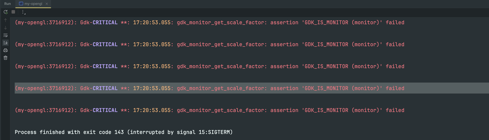

[配置参考官方手册](https://rawcdn.githack.com/VirtualGL/virtualgl/3.0/doc/index.html#hd006)

尝试了一下，过于复杂，而且我担心破坏现在archlinux上在使用的kde，所以放弃了。

转换一个思路，linux远程开发opengl改成本地mac开发