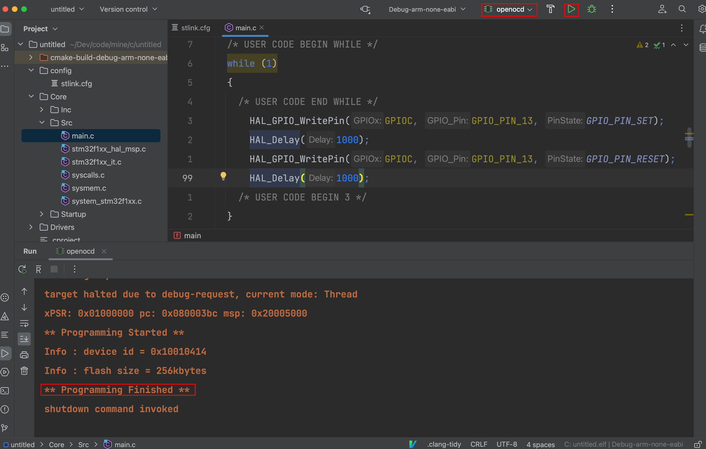

### 1 环境

| Name              | Version   | Mark              | Download\Install                                             |
| ----------------- | --------- | ----------------- | ------------------------------------------------------------ |
| macOS             | 11.5.2    | -                 | -                                                            |
| Clion             | 2023.1.1  | -                 | -                                                            |
| STM32CubeMX       | 6.7.0     | 创建初始化stm工程 | https://www.st.com/en/development-tools/stm32cubemx.html#get-software |
| arm-none-eabi-gcc | 12.2.Rel1 | 交叉编译          | https://developer.arm.com/downloads/-/arm-gnu-toolchain-downloads |
| open-ocd          | 0.11.0    | 烧录器            | brew install open-ocd                                        |

### 2 Clion设置

#### 2.1 toolChain

#### 2.2 cmake

#### 2.3 openocd && cubemx

### 3 新建项目

#### 3.1 clion创建项目

创建项目的过程就是Clion通过上面配置的STM32CubeMX进行初始化，创建好后弹出让我们选择板型配置文件的弹窗，这个文件是后面用来烧录程序用的，也就是openocd要识别的配置文件，现在可以选择跳过，后面到了烧录步骤再单独配置。

#### 3.2 配置MCU

##### 3.2.1 cube打开项目

找到刚才通过clion创建的项目。

##### 3.2.2 mcu型号

生成的默认的项目的stm芯片型号不一定刚好就是自己需要的，比如在下手里只有一个STM32F103C8T6的最小电路，那么我们就更改成自己需要的型号。

##### 3.3.3 sys设置

我买的板子，附带了一个stlink下载器，到时候烧录程序就是通过openocd+usb stlink。

##### 3.3.4 rcc设置

##### 3.3.5 管脚设置

###### 3.3.5.1 led电路原理图

LED阳极是3.3V电压，阴极接的是PC13网络标号的管脚。

那么给PC13高电平，LED就灭，给PC13低电平，LED就亮。

###### 3.3.5.2 PC13管脚设置

#### 3.3 项目配置

* 首先，注意项目路径及项目名，要跟clion创建好的相同，我们的目的是为了将配置好的项目信息覆盖到原有的项目上。
* 其次，开发工具下拉选项没有Clion，因此我就随便选了一个STM32CubeIDE。

#### 3.4 保存项目配置

### 4 项目开发

#### 4.1 cmake配置

#### 4.2 编译

#### 4.3 openocd

##### 4.3.1 配置文件

##### 4.3.2 配置项

#### 4.4 code

#### 4.5 烧录

##### 4.1 烧录程序

##### 4.2 观察开发板led闪烁情况
