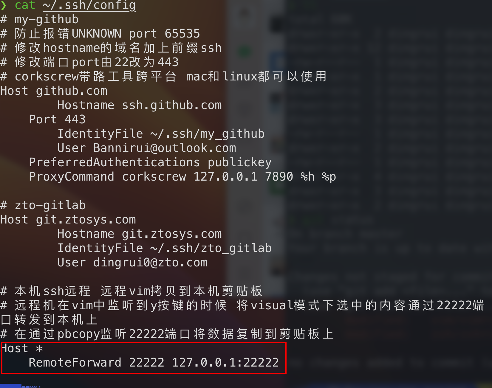
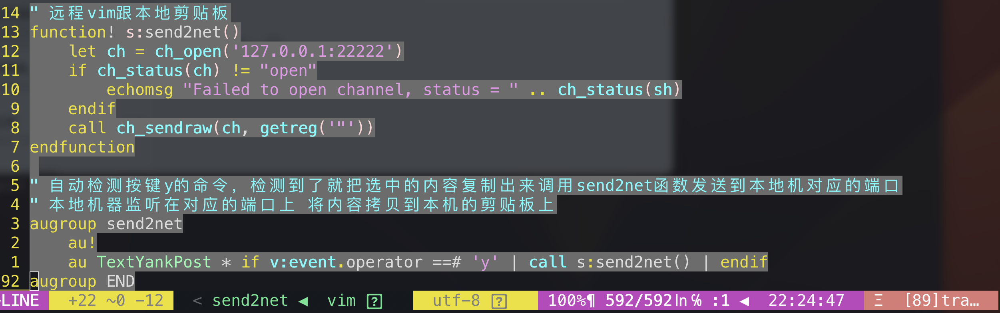

尤其是在写博客的时候，一边用vim看代码，一边写博客，可能需要将代码内容复制到博客中。

1 本机vim交互本机剪贴板
---

开启剪贴板功能即可

```shell
" 跟系统剪贴板交互
" vim的visual模式下选中的内容 按键y之后 内容既被复制到了vim的寄存器
" 也被复制到了系统剪贴板
" 系统剪贴板中的内容 在vim的normal模式下 按键p即可以将内容粘贴到vim中
set clipboard=unnamed
```

2 远程机vim交互本机剪贴板
---

### 2.1 设置本机

本机是mac，添加`~/.ssh/config`配置文件

- 本机与远程机建立ssh连接的时候额外建立一条指定端口的通讯，本地机监听在这个端口，等待远程机发送数据过来

- 本地机收到了数据，将数据写到本地机的剪贴板上



#### 2.2 确认远程机端口转发功能

`netstat`是`net-tool`的工具

- 确认是否已经安装`netstat --version`

- 确认是否已经下载`yay -Q |grep net-tools`

- 查询`yay -Ss net-tools`

- 下载安装`yay -Syy net-tools`

验证远程机端口转发功能`netstat -ntlp | grep -w 22222`


### 2.3 设置远程机vim复制指令

vim的visual模式下检测到TextYankPost指令就将选中内容发送到socket端口上，即通过数据通道从服务机发送到本地。



### 2.4 本地机启动一个进程监听在端口复制数据到剪贴板

当远程机将数据发送回本地机端口时，本地机启动一个进程监听在该端口，将数据复制到剪贴板。

#### 2.4.1 监听服务


文件路径`vim ~/Library/LaunchAgents/pbcopy.plist`

```shell
<?xml version="1.0" encoding="UTF-8"?>
<!DOCTYPE plist PUBLIC "-//Apple Computer//DTD PLIST 1.0//EN" "http://www.apple.com/DTDs/PropertyList-1.0.dtd">
<plist version="1.0">
    <dict>
        <key>Label</key>
            <string>localhost.pbcopy</string>
        <key>ProgramArguments</key>
        <array>
            <string>/usr/bin/pbcopy</string>
        </array>
        <key>inetdCompatibility</key>
        <dict>
            <key>Wait</key>
            <false/>
        </dict>
        <key>Sockets</key>
        <dict>
            <key>Listeners</key>
            <dict>
                <key>SockServiceName</key>
                <string>22222</string>
                <key>SockNodeName</key>
                <string>127.0.0.1</string>
            </dict>
        </dict>
    </dict>
</plist>
```

#### 2.4.2 启动监听服务

`launchctl load -w ~/Library/LaunchAgents/pbcopy.plist`

#### 2.4.3 检查监听服务状态

`launchctl list | grep localhost.pbcopy`

信息如下，说明该程序正常监听在22222端口，等待数据到来，复制到剪贴板上


### 2.5 测试

至此，远程端和本机端都已经配置好了

- 在远程任意文件的vim中复制删除修改内容

  - nornal模式下的y d c x s的内容

  - normal模式下yy复制的行内容

  - visual模式下y复制的块内容

- 切换到本地机任意应用`command+v`即可粘贴

> 但是现在遇到一个问题是中文无法从远程vim的寄存器发送到本机的系统剪贴板上

- 首先我远程vim的默认复制的内容都会放在unnamed寄存器上

- 其次我远程vim用的通道ch_open内置函数指定的消息mode是raw

- 再者远程vim内置函数ch_sendraw发送的内容是获取的unnamed寄存器

- 我给远程机器系统剪贴板配置了从unnamed寄存器`set clipboard=unnamed`读取内容，中文的复制粘贴是没有问题的

- 因此问题很可能是出现在了接收端 不知道是不是在mac端编解码出现了问题

3 本机vim交互远程机剪贴板
---

本质跟2是一样的，这种场景我用不到，不作赘述。