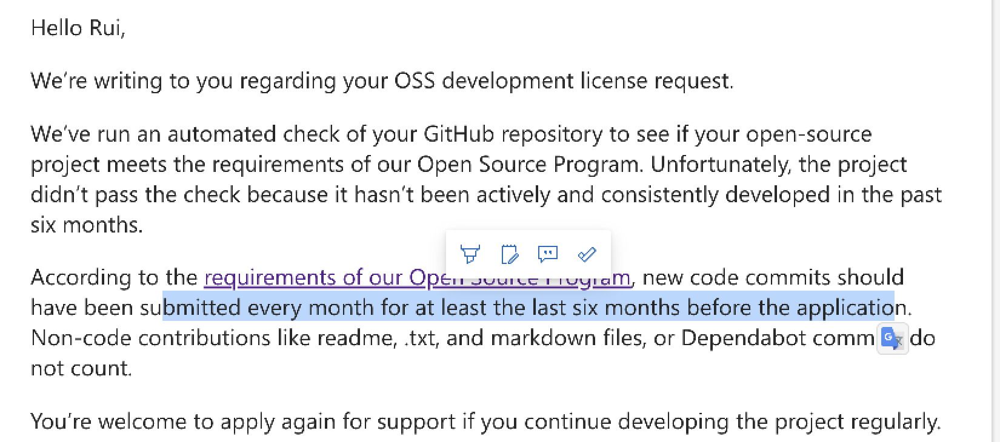

JB的license申请越来越难了，萌生了放弃白嫖的想法。现在使用的license还有几个月就到期了，为了防止临时切换开发环境带来的不便，决定从现在开始转vscode，先适应起来。



### 1 插件

- Extension Pack for Java

- Spring Boot Extension Pack

### 2 maven配置

本机使用的maven版本是3.9.x，然后maven在3.8.x之后为了安全会将非https的远端仓库屏蔽掉，现实是大部分公司的私服地址都是http的，因此要在maven的配置文件中覆盖掉默认配置中的镜像配置

./m2/settings.xml中增加如下

```xml
        <!--使用dummy镜像覆盖默认配置中的镜像配置-->
        <mirror>
            <id>maven-default-http-blocker</id>
            <mirrorOf>external:dummy:*</mirrorOf>
            <name>Pseudo repository to mirror external repositories initially using HTTP.</name>
            <url>http://0.0.0.0.0/</url>
            <blocked>true</blocked>
        </mirror>
```

### 3 vscode配置

```json
{
    // jdk
    "java.configuration.runtimes": [
        {
            "name": "JavaSE-1.8",
            "path": "/usr/local/Cellar/openjdk@8/1.8.0-392",
            "default": true
        },
    ],
    // maven配置
    "java.configuration.maven.globalSettings": "/Users/dingrui/.m2/settings.xml",
    "java.configuration.maven.userSettings": "/Users/dingrui/.m2/settings.xml",
    "maven.executable.path": "/usr/local/Cellar/maven/3.9.4/bin/mvn",
    "maven.view": "hierarchical",
    "maven.executable.options": "-s /Users/dingrui/.m2/settings.xml",
    "maven.terminal.customEnv": [
        {
            "environmentVariable": "JAVA_HOME",
            "value": "/usr/local/Cellar/openjdk@8/1.8.0-392"
        }
    ],
    "maven.terminal.useJavaHome": true,
    "maven.terminal.favorites": [
        {
            "command": "clean package -DskipTests"
        }
    ],
}
```

### 4 vim插件配置

```json
{
    // vim配置
    // 习惯了vimrc的配置 保留操作习惯
    "vim.vimrc.enable": true,
    "vim.leader": ",",
    "vim.easymotion": true,
    "vim.incsearch": true,
    "vim.useSystemClipboard": true,
    "vim.useCtrlKeys": true,
    "vim.hlsearch": true,
    "editor.lineNumbers": "relative",
    "vim.normalModeKeyBindingsNonRecursive": [
        // tt -> 终端
        {
            "before": [
                "t",
                "t"
            ],
            "commands": [
                "workbench.action.terminal.focus"
            ]
        },
    ],
    // 配置热键方案
    "vim.normalModeKeyBindings": [
        // T -> vs快捷命令
        {
            "before": [
                "T"
            ],
            "commands": [
                "workbench.action.showCommands",
            ],
            "silent": true
        },
        // g+[ -> 上一个文件
        {
            "before": [
                "g",
                "["
            ],
            "commands": [
                "editor.action.marker.prevInFiles"
            ],
            "silent": true
        },
        // g+] -> 下一个文件
        {
            "before": [
                "g",
                "]"
            ],
            "commands": [
                "editor.action.marker.nextInFiles"
            ],
            "silent": true
        },
        // 上一个位置
        {
            "before": [
                "cmd",
                "["
            ],
            "commands": [
                "workbench.action.navigateBack"
            ]
        },
        // 下一个位置
        {
            "before": [
                "cmd",
                "]"
            ],
            "commands": [
                "workbench.action.navigateForward"
            ]
        },
        // 全局搜索文件名
        {
            "before": [
                "<leader>",
                "f",
                "f"
            ],
            "commands": [
                "workbench.action.quickOpen"
            ]
        },
        // zz -> 折叠代码块
        {
            "before": [
                "z",
                "z"
            ],
            "commands": [
                "editor.toggleFold"
            ],
            "silent": true
        },
        // 定义
        {
            "before": [
                "g",
                "d"
            ],
            "commands": [
                "editor.action.revealDefinition"
            ]
        },
        // 引用
        {
            "before": [
                "g",
                "r"
            ],
            "commands": [
                "editor.action.goToReferences"
            ]
        },
        // 实现
        {
            "before": [
                "g",
                "i"
            ],
            "commands": [
                "editor.action.goToImplementation"
            ]
        },
        // 全局搜索文件名
        {
            "before": [
                "<leader>",
                "f",
                "f"
            ],
            "commands": [
                "workbench.action.quickOpen"
            ]
        },
        // 全局搜索文字
        {
            "before": [
                "<leader>",
                "f",
                "w"
            ],
            "commands": [
                "workbench.action.findInFiles"
            ]
        },
        // 格式化代码
        {
            "before": [
                "<leader>",
                "f"
            ],
            "commands": [
                "editor.action.formatDocument"
            ]
        },
    ],
    // 下面定义的按键将交由vscode进行处理 而不是vscode-vim插件
    "vim.handleKeys": {
        // command
        "<D-a>": false,
        "<D-f>": false,
        "<D-s>": false,
        "<D-c>": false,
        "<D-v>": false,
        "<C-b>": false,
        "<C-f>": false,
    },
    "extensions.experimental.affinity": {
        "vscodevim.vim": 1
    },
}
```

### 5 热键配置

```json
// Place your key bindings in this file to override the defaultsauto[]
[
    {
        "key": "cmd+[",
        "command": "workbench.action.navigateBack"
    },
    {
        "key": "ctrl+-",
        "command": "-workbench.action.navigateBack"
    },
    {
        "key": "cmd+]",
        "command": "workbench.action.navigateForward"
    },
    {
        "key": "ctrl+shift+-",
        "command": "-workbench.action.navigateForward"
    },
    {
        "key": "f12",
        "command": "-editor.action.revealDefinition",
        "when": "editorHasDefinitionProvider && editorTextFocus && !isInEmbeddedEditor"
    },
    {
        "key": "cmd+1",
        "command": "-workbench.action.focusFirstEditorGroup"
    },
]
```