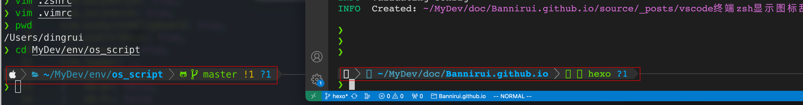
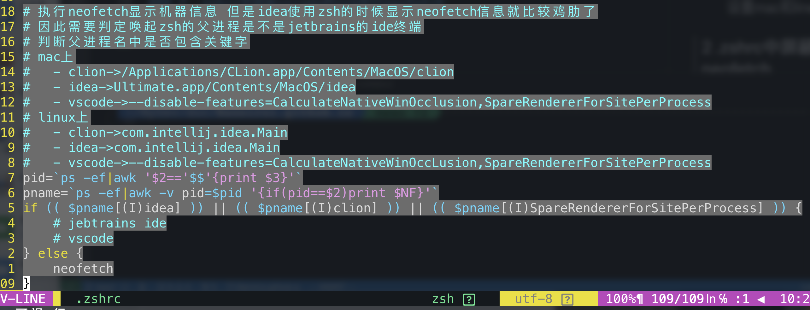

今天留意到3个问题

- mac终端iterm2和vscode终端显示差异，vscode中zsh乱码
- mac终端iterm2和linux终端konsole显示差异，konsole中乱码
- vscode中执行了neofetch显示了设备信息，要在.zshrc中排除

第一第二个问题的解决方案是统一设备和程序的字体

- mac和linux终端使用同一个字体
- 终端和vscode使用同一个字体

第三个问题的解决方案是在mac和linux上调试一下vscode唤起的zsh父进程名

### 1 跨平台字体

- 我找到了一款字体[Menlo-for-Pwoerline](https://github.com/lxbrtsch/Menlo-for-Powerline)，README中也详细介绍了如何在mac和linux上安装。

- 然后在终端执行`p10k configure`重新设置mac和linux的终端显示风格。

### 2 .zshrc中屏蔽vscode的zsh执行neofetch

