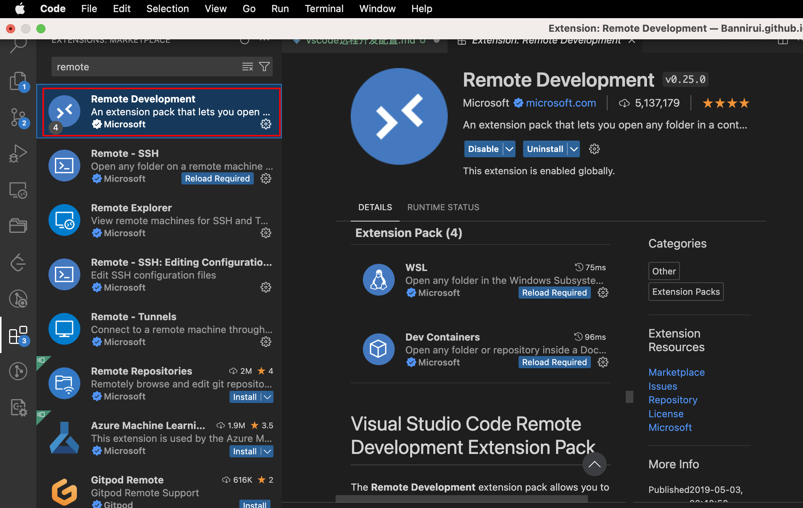
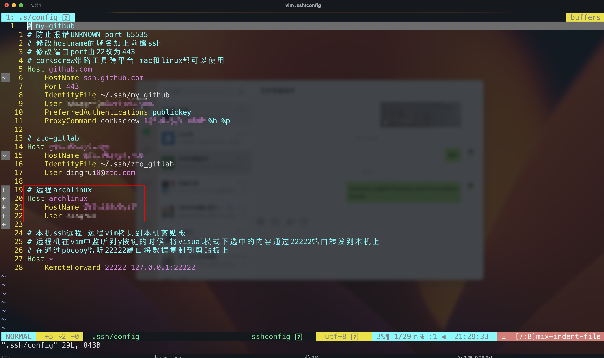
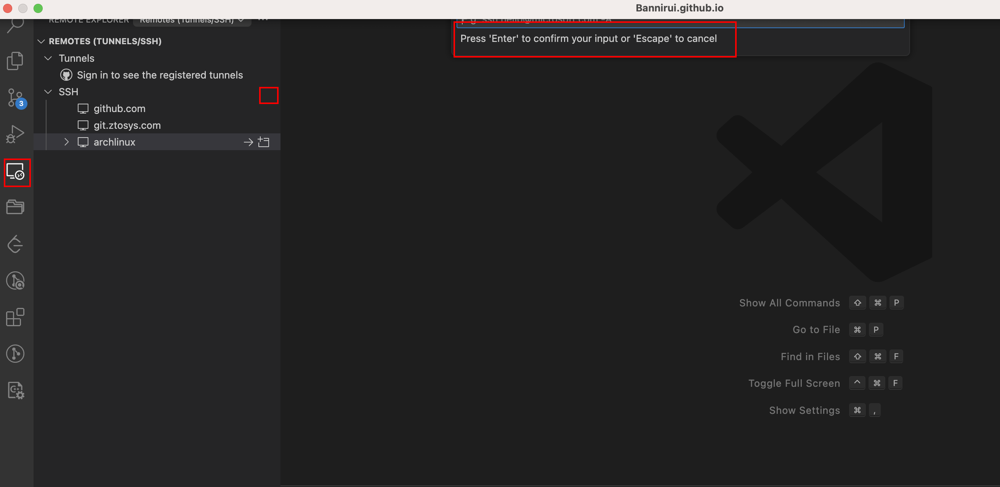
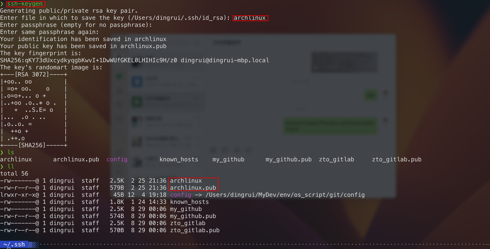
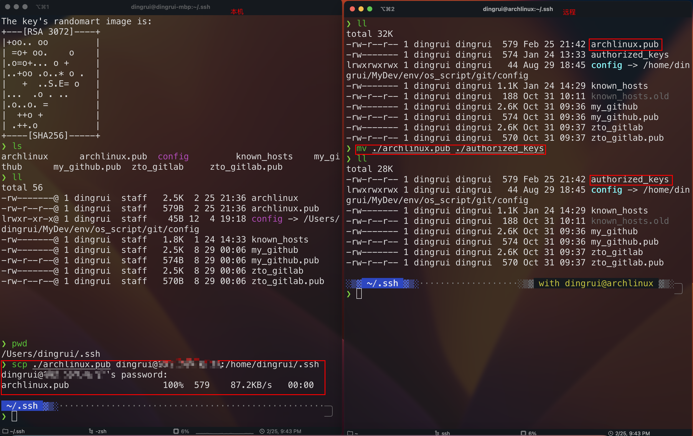
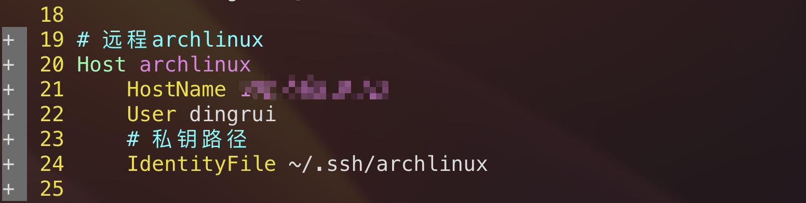

之前配置过，最近也一直在使用。

我在vscode和IDE中一直也用的vim模拟器，所以很多时候还得gui+vim比较丝滑，因此配置一下vscode+ssh的方式。

### 1 vscode插件安装

安装Remote Development插件



### 2 ssh连接

在`Remote Explorer`中新增一条ssh连接，根据提示键入`ssh 远程用户名@远程主机ip地址`即可，之后vscode便会提示将ssh存储到sshconfig文件中，选择默认的`~/.ssh/config`中，并且对该文件稍作修改，将其host域名修改一下自己知道的标识名称，之后的免密登陆也会用到这个文件。

本机ssh配置文件



至此，便可以进行ssh连接和远程服务器的文件夹访问



### 3 ssh免密配置

但是现在每次的连接和远程的访问都要手动输入密码，配置一下ssh免密登陆即可一劳永逸。

#### 3.1 ssh-keygen生成密钥文件

每个人可能都要很多不同场景ssh密钥管理，自定义文件名用于区别即可。

```shell
cd ~/.ssh
ssh-keygen
```



#### 3.2 远程公钥

上述生成的两个文件

- archlinux 私钥 放本地

- archlinux.pub 公钥 放远程



#### 3.3 ssh配置私钥路径

本机ssh配置文件指定IdentityFile，私钥文件路径



至此，就不需要手动录入密码了