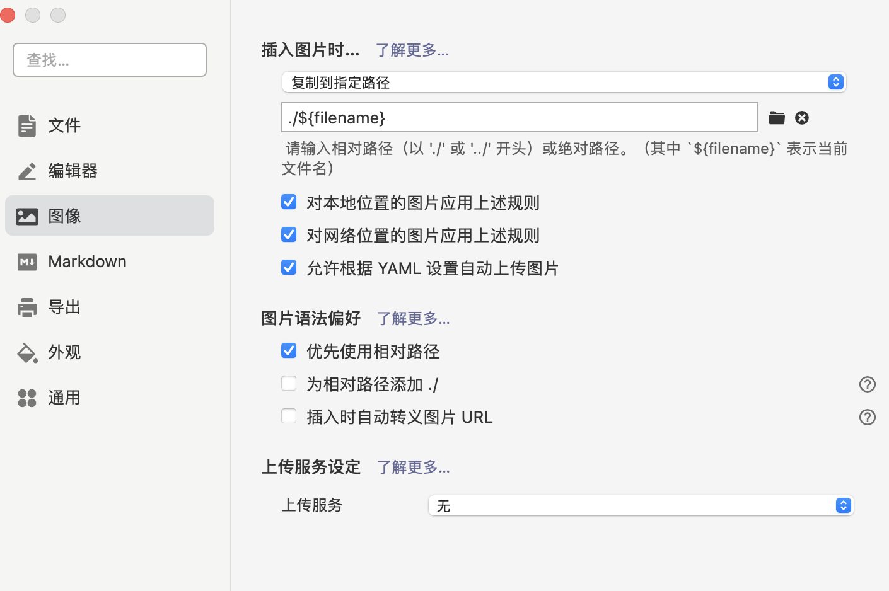
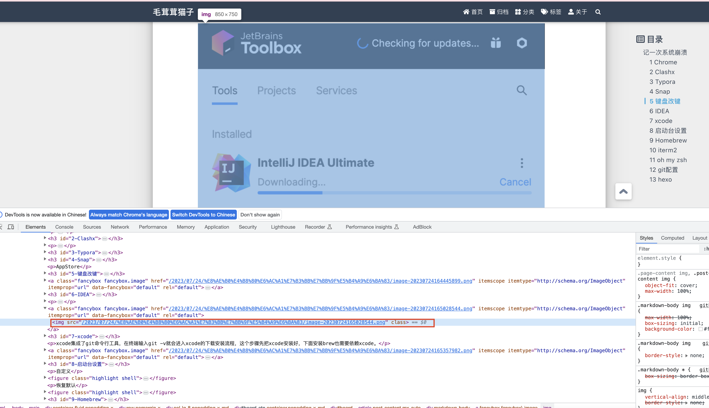
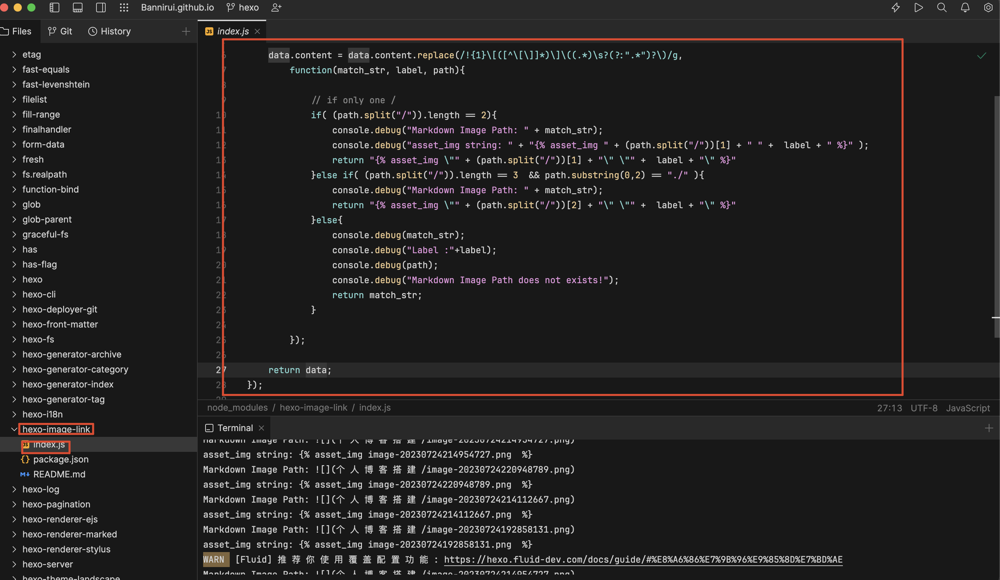
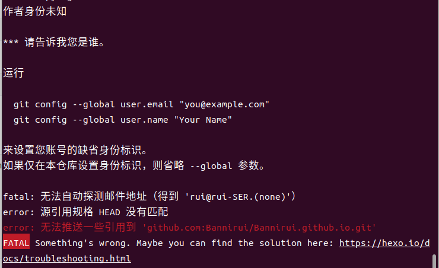
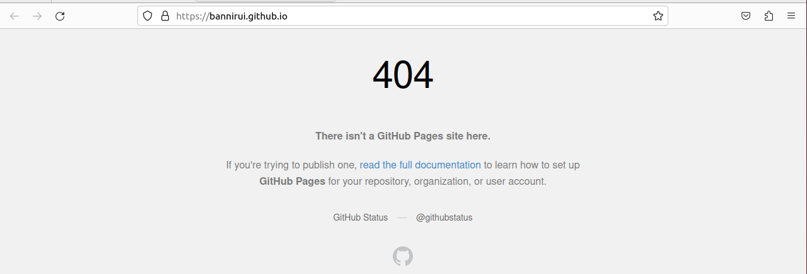
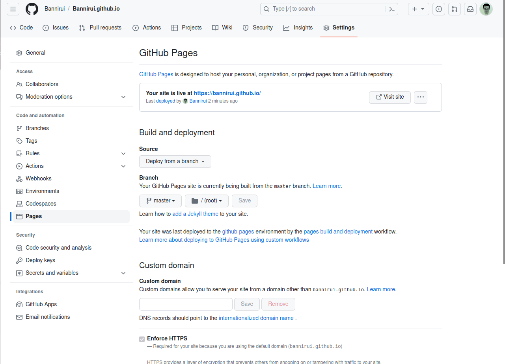

GitHub Pages + Hexo组合搭建个人博客环境

### 1 Github

#### 1.1 创建仓库

创建仓库{用户名}.github.io，将来即可根据域名https://{用户名}.github.io/访问博客。

#### 1.2 设置GitHub Pages



#### 1.3 创建Token给Hexo使用

配置全局变量GITHUB_TOKEN_FOR_HEXO



### 2 Hexo

#### 2.1 安装

先安装node，通过node安装Hexo

```shell
brew install node
npm install -g hexo-cli
```

#### 2.2 创建项目

```shell
hexo init hexo-blog
```

#### 2.3 初始化启动

```shell
cd hexo-blog
npm install
hexo s
```

#### 2.4 安装Fluid主题

[Fluid官网](https://github.com/fluid-dev/hexo-theme-fluid)，根据README操作。

##### 2.4.1 指定主题

修改hexo-blog项目目录下_config.yml

```yaml
theme: fluid
```

##### 2.4.2 创建AboutMe

```shell
hexo new page about
```

修改`/source/about/index.md`，添加`layout`属性

```shell
> more source/about/index.md
---
title: about
date: 2023-02-27 22:43:06
layout: about
---
```

#### 2.5 文章同名资源目录

存放图片文件

修改hexo-blog项目目录下_config.yml

```yaml
post_asset_folder: true
```

#### 2.6 个性化页面

##### 2.6.1 浏览器tab页名称

修改`/hexo-blog/_config.yml`中`title`

```yaml
5 # Site
6 title: 光秃秃的猫子
7 subtitle: ''
8 description: 'Bannirui博客'
9 keywords:
10 author: Banirui
11 language: zh-CN
12 timezone: ''
```

##### 2.6.2 博客主题

修改`/hexo-blog/themes/fluid`中`blog_title`

```yaml
blog_title: "光秃秃的猫子"
```

##### 2.6.3 主页文字

修改`/hexo-blog/themes/fluid`中`text`

```yaml
text: "Bannriui的个人博客"
```

#### 2.7 image path

##### 2.7.1 typora setting



##### 2.7.2 plugin

```shell
npm install hexo-image-link --save
```

##### 2.7.3 compile

```shell
hexo clean && hexo g && hexo s
```

##### 2.7.4 check



##### 2.7.5 index.js

即编译好的图片是放在public文件夹下/yyyy/mm/dd/title/img.png路径，如果发现hexo页面的图片路径不对，则修改插件hex-image-link的源码。



#### 2.8 发布到GitHub

##### 2.8.1 安装hexo-deployer-git

```shell
npm install hexo-deployer-git --save
```

##### 2.8.2 配置token

修改`/hexo-blog/_config.yml`中`deploy`

```yaml
deploy:
  type: git
  repo: git@github.com:Bannirui/Bannirui.github.io.git
  branch: master
  token: $GITHUB_TOKEN_FOR_HEXO
```

将github的token配置在环境变量中

##### 2.8.3 创建文章

```shell
hexo new post {文章名称}
```

##### 2.8.4 发布访问

```shell
hexo g -d
```

#### 2.9 更换新设备

##### 2.9.1 clone

```shell
git clone git@github.com:Bannirui/Bannirui.github.io.git

cd Bannirui.github.io

sudo npm install

hexo s
```

##### 2.9.2 报错



```shell
git config --global user.name "Banirui"
git config --global user.email "banirui@outlook.com"
```


执行完依然报错，就索性删除了远程master分支

```shell
git push origin :master

hexo clean && hexo g -d
```


但是github pages的页面不能正确打开博客了




重新配置github pages


