因为mbp笔电突然坏了，导致在一段时间内折腾了多个系统平台的使用习惯，最终最中意的优先级为mac\arch\ubuntu，记录下常用软件和用户配置习惯。

### 1 MacOS

#### 1.1 Chrome

https://www.google.com/chrome/

#### 1.2 Clashx

https://github.com/yichengchen/clashX/releases

#### 1.3 Typora

typora从0.11.8之后开始收订阅费，有好心人整理了各平台的安装包链接。

https://zahui.fan/posts/64b52e0d/

#### 1.4 Snap

#### 1.5 XBows键盘映射


#### 1.6 IDE

https://www.jetbrains.com/toolbox-app/

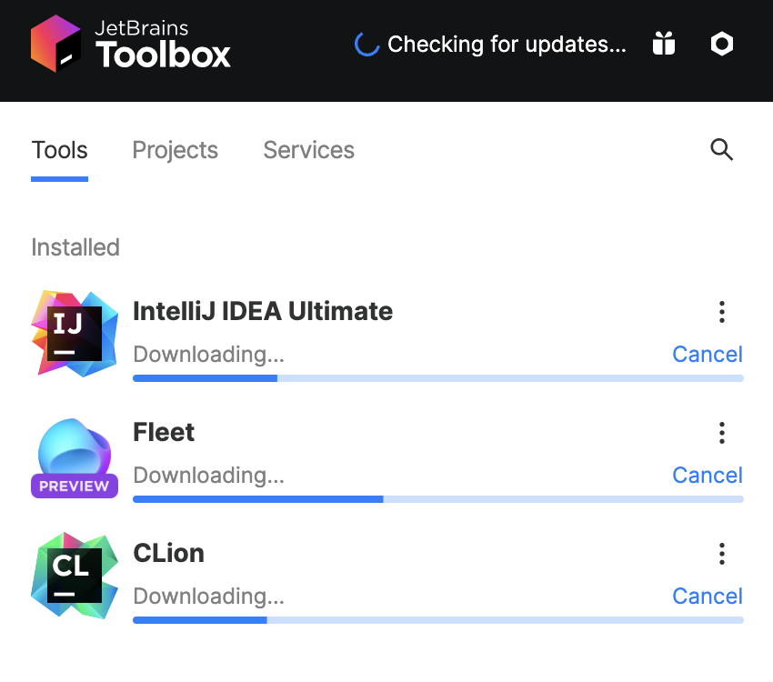

#### 1.7 xcode


#### 1.8 启动台设置

自定义

```shell
defaults write com.apple.dock springboard-columns -int 9

defaults write com.apple.dock springboard-rows -int 6

defaults write com.apple.dock ResetLaunchPad -bool TRUE

killall Dock
```


恢复默认

```shell
defaults write com.apple.dock springboard-rows Default

defaults write com.apple.dock springboard-columns Default

defaults write com.apple.dock ResetLaunchPad -bool TRUE

killall Dock
```

#### 1.9 Homebrew

##### 1.9.1 install

```shell
/bin/bash -c "$(curl -fsSL https://raw.githubusercontent.com/Homebrew/install/HEAD/install.sh)"
```

##### 1.9.2 check


#### 1.10 iterm2

##### 1.10.1 install

```shell
brew install iterm2
```

##### 1.10.2 icon


##### 1.10.3 size

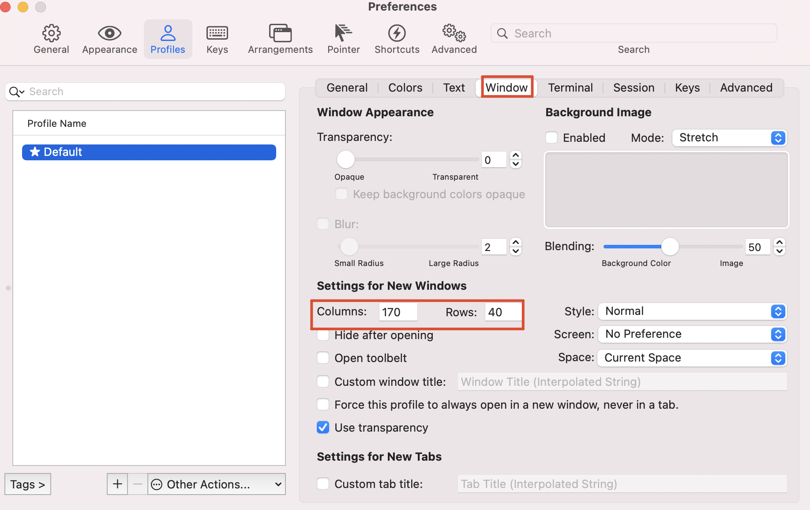

##### 1.10.4 font


#### 1.11 编程环境

通过git的私人仓库os-script脚本配置

- vim
- zsh
- maven
- git
- ideavim
- codestyle

#### 1.12 hexo



### 2 Ubuntu

零刻Ser6ProVest，配置是AMD-R7+32G+1T，刷了Ubuntu系统作为主力机。

* 下载ubuntu桌面板iso，做u盘启动盘
* mini主机背面有提示，Dlete键进BIOS设置，F7引导选项
* bios->security->secure mode=standard
* bios->security->secure boot=enabled
* bios->boot->boot option#1=USB Device:UEFI

#### 2.1 keyboard mapping

```shell
cd /usr/share/X11/xkb/keycodes/

sudo cp evdev evdev.bak
```

将<LALT>和<LCTL>的值互换，然后保存，注销重启。

#### 2.2 clash

##### 2.2.1 download

https://v2rayse.com/client/#google_vignette

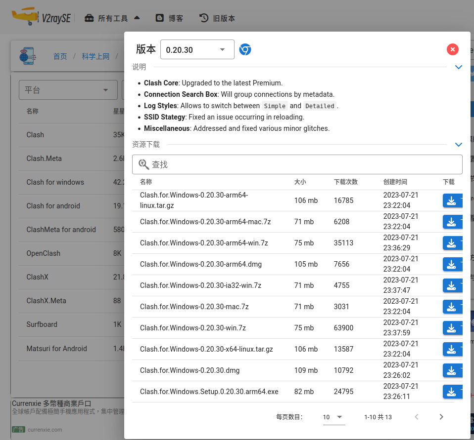

Clash.for.Windows-0.20.30-x64-linux.tar.gz

##### 2.2.2  创建文件夹

mkdir /home/Documents/softWare

##### 2.2.3 unzip

```shell
mv /home/Downloads/Clash.for.Windows-0.20.30-x64-linux.tar.gz /home/Documents/softWare

cd /home/Documents/softWare

tar -zxvf Clash.for.Windows-0.20.30-x64-linux.tar.gz

rm -rf *.gz

mv Clash.for.Windows-0.20.30-x64-linux clash
```

##### 2.2.4 icon

为其下载图片作为icon

/home/rui/Documents/softWare/clash/Clash_Logo.png

##### 2.2.4 制作桌面启动器

```shell
/home/rui/.local/share/applications

vi clash.desktop
```

内容如下

```shell
[Desktop Entry]
Name=clash for windows
Icon=/home/rui/Documents/softWare/clash/Clash_Logo.png
Exec=/home/rui/Documents/softWare/clash/cfw
Type=Application
```

权限

```shell
chmod +x clash.desktop
```

##### 2.2.5 App

添加到Dock栏
显示应用程序-添加到收藏夹


##### 2.2.6 Dock


#### 2.3 Typora

现在Typora已经开始收费，因此安装免费版本

```shell
cd /home/rui/Downloads

wget https://file.babudiu.com/f/yXCL/Typora_Linux_0.11.18_amd64.deb

sudo dpkg -i Typora_Linux_0.11.18_amd64.deb
```

#### 2.4 ~~公司软件~~

为了连接wifi，需要安装一个AppImage文件

##### 2.4.1 download

/home/rui/Documents/softWare/baohe/box.linux.8.22.9.19.AppImage

```shell
mv ~/Downloads/box.linux.8.22.9.19.AppImage ~/Documents/softWare/baohe
cd Documents/softWare/baohe
chmod +x box.linux.8.22.9.19.AppImage
```

##### 2.4.2 Dock

```shell
cd /home/rui/.local/share/applications

vi baohe.desktop
```

内容如下

```shell
[Desktop Entry]
Name=baohe
Icon=/home/rui/Documents/softWare/baohe/baohe_logo.png
Exec=/home/rui/Documents/softWare/baohe/box.linux.8.22.9.19.AppImage
Type=Application
```

可能需要安培FUSE

```shell
sudo add-apt-repository universe
sudo apt install libfuse2
```

权限

```shell
chmod +x baohe.desktop
```

##### 2.4.3 App


##### 2.4.4 uninstall

```shell
rm -rf /home/rui/.local/share/applications/baohe.desktop
rm -rf /home/rui/Documents/softWare/baohe
```

#### 2.5 终端

terminator

##### 2.5.1.1 install

```shell
sudo add-apt-repository ppa:gnome-terminator
sudo apt update
sudo apt install terminator
```

##### 2.5.1.2 设置为默认终端

```shell
gsettings set org.gnome.desktop.default-applications.terminal exec /usr/bin/terminator
gsettings set org.gnome.desktop.default-applications.terminal exec-arg "-x"
```

若想要设置回去

```shell
gsettings reset org.gnome.desktop.default-applications.terminal exec
gsettings reset org.gnome.desktop.default-applications.terminal exec-arg
```

##### 2.5.1.3 配置

编辑区右键-配置文件首选项


###### 2.5.1.3.1 字体


###### 2.5.1.3.2 颜色

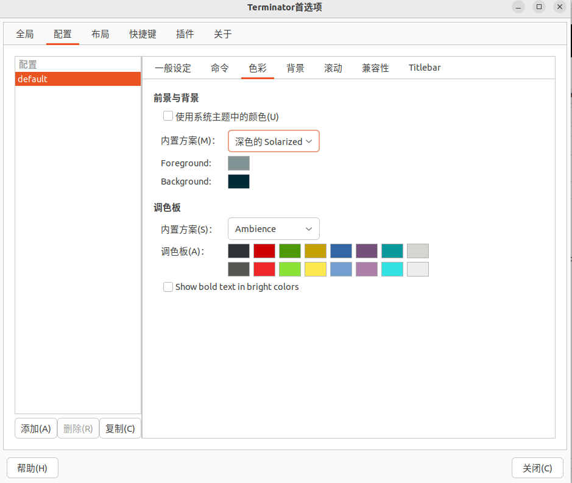

#### 2.6.2 zsh

##### 2.6.2.1 install

```shell
cat /etc/shells 
```

文件内容中没有zsh，则需要安装

```shell
sudo apt update
sudo apt install zsh -y
```

zsh as system default shell

```shell
sudo chsh -s /bin/zsh
```

##### 2.6.2.2 setting

```shell
sudo apt install curl

sh -c "$(curl -fsSL https://raw.github.com/ohmyzsh/ohmyzsh/master/tools/install.sh)"

sudo apt install powerline fonts-powerline
```

#### 2.7 IDE

https://www.jetbrains.com/toolbox-app/


```shell
mkdir /home/rui/Documents/softWare/jb
cd /home/rui/Documents/softWare/jb
mv ~/Downloads/jetbrains-toolbox-1.28.1.15219.tar.gz ./
tar -zxvf jetbrains-toolbox-1.28.1.15219.tar.gz 
rm -rf *.gz
cd jetbrains-toolbox-1.28.1.15219
./jetbrains-toolbox
```

##### 2.7.1 settings


##### 2.7.2 jdk

```shell
apt-cache search openjdk
sudo apt install openjdk-8-jdk
sudo apt install openjdk-18-jdk

sudo update-alternatives --config java
```

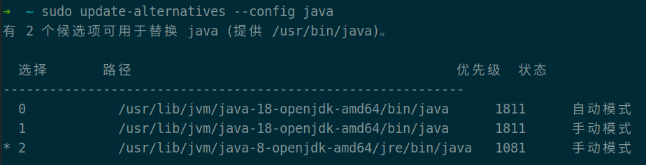

##### 2.7.3 shortcuts

###### 2.7.3.1 settings

Command+,


###### 2.7.3.2 project structure

Command+;


###### 2.7.3.3 close tab

Command+w

###### 2.7.3.4 keymap


###### 2.7.3.5vim conflicts

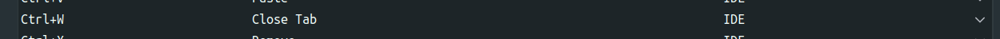

###### 2.7.3.6 project tool

Command+1


###### 2.7.3.7 IDEA and Vim

conflicts between IDEA and Vim


###### 2.7.3.8 generate code

Command+N


##### 2.7.4 make

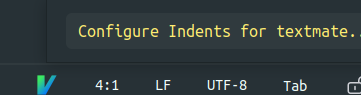

##### 2.7.5 code style



下载的.xml文件根据自已需求更改。

#### ~~2.8 magic pad~~

##### 2.8.1 touchegg

```shell
sudo add-apt-repository ppa:touchegg/stable
sudo apt update
sudo apt install touchegg
```

安装好后执行touchegg命令，然后重启，会自动启动。

##### 2.8.2 touche

```shell
cd ~/Downloads
wget https://github.com/JoseExposito/touche/releases/download/1.0.7/touche_1.0.7_amd64.deb
sudo dpkg -i touche_1.0.7_amd64.deb
```

可能报错

```shell
sudo apt-get -f install
sudo dpkg -i touche_1.0.7_amd64.deb
```

重启后在应用列表中可以看到touche

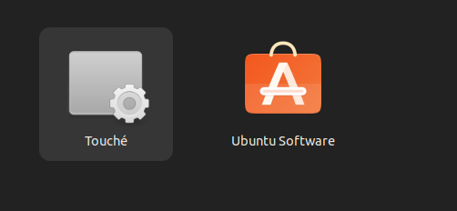

##### 2.8.3 uninstall

It is not very good

```shell
sudo apt-get remove touchegg
sudo apt-get remove touche

sudo apt-get autoremove
```

#### 2.9 screenshots

bind keymap to F1

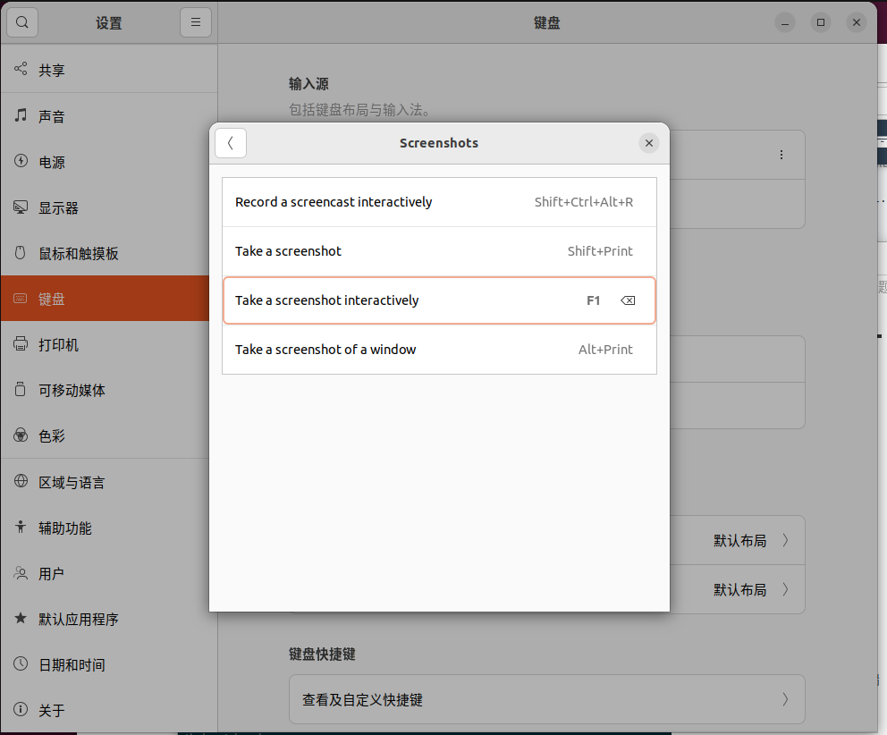

#### 2.10 Clion

##### 2.10.1 nasm

```shell
sudo apt-cache search nasm

sudo apt install nasm

nasm -v
```

##### 2.10.2 python

```shell
python3 --version

whereis python3

cd /usr/local/bin

sudo ln -s ../../bin/python3 python

ptyhon --version
```

##### 2.10.3 pip

```shell
apt-cache search python3-pip

sudo apt update

sudo apt install python3-pip

pip --version
```

##### 2.10.4 openocd

```shell
apt-cache search openocd

sudo apt update

sudo apt install openocd

openocd -v

dpgk -L openocd
```


##### 2.10.5 arm-none-eabi-gcc

```shell
dkpg -L arm-none-eabi-gcc

apt-cache search arm-none-eabi-gcc
apt-cache search gcc-arm-none-eabi

sudo apt update
sudo apt install gcc-arm-none-eabi

arm-none-eabi-gcc -v
```

##### 2.10.6 toolchain

```shell
whereis make
whereis arm-none-eabi-gcc
whereis arm-none-eabi-g++
```

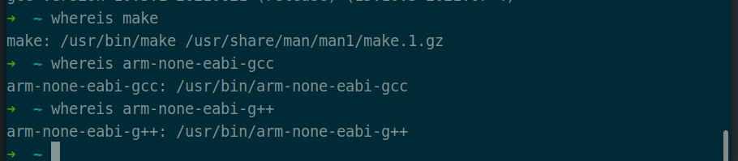


##### 2.10.7 cmake

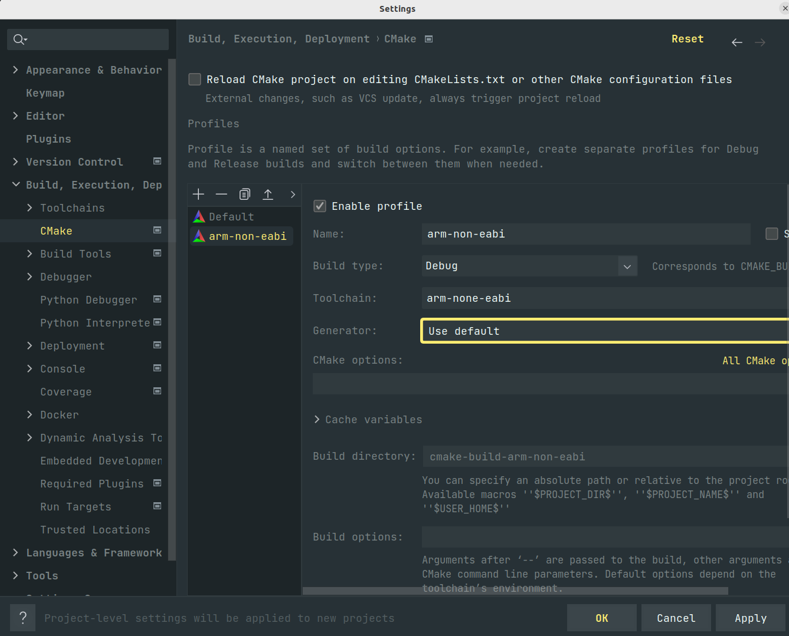

##### 2.10.8 STM32CubeMX

###### 2.10.8.1 download

https://www.st.com/en/development-tools/stm32cubemx.html#get-software

###### 2.10.8.2 install

```shell
cd Documents/softWare
mkdir -p stm && cd stm
cp ~/Downloads/en.stm32cubemx-lin-v6-9-1.zip ./
unzip en.stm32cubemx-lin-v6-9-1.zip
rm -rf *.zip
./SetupSTM32CubeMX-6.9.1
```

then click button or specify path as you want


###### 2.10.8.3 make a dock

* execute path

  

* logo

  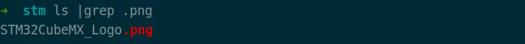

* desktop

  ```shell
  cd /home/rui/.local/share/applications
  cp clash.desktop stm32cubemx.desktop
  ```

  

* add to favorites

  

* settings

  

###### 

#### 2.11 ctags

```shell
sudo apt update
apt-cache search ctags

sudo apt install universal-ctags

dpkg -l |grep -i ctags
```

#### 2.12 编程环境

通过git的私人仓库os-script脚本配置

- vim
- zsh
- maven
- git
- ideavim
- codestyle

#### 2.12 xclip

```shell
apt-cache search xclip
sudo apt update
sudo apt install xclip
```

#### 2.13 yt-dlp

```shell
pip install yt-dlp
yt-dlp --version

sudo apt update
apt-cache search ffmpeg
sudo apt install ffmpeg

yt-dlp https://www.bilibili.com/video/BV1zy4y1b7jZ/\?spm_id_from\=333.999.0.0\&vd_source\=4f8115abf6e07772d02db76f3b552dba --proxy socks5://127.0.0.1:7890 -F

yt-dlp https://www.bilibili.com/video/BV1zy4y1b7jZ/\?spm_id_from\=333.999.0.0\&vd_source\=4f8115abf6e07772d02db76f3b552dba --proxy socks5://127.0.0.1:7890
```

#### 2.14 KiCad

```bash
sudo add-apt-repository ppa:kicad/kicad-7.0-releases
sudo apt update
sudo apt install kicad
```

#### 2.15 中文输入法

```shell
sudo apt update
apt-cache ibus-rime
sudo apt install ibus-rime
```

### 3 ArchLinux

#### 3.1 系统安装

##### 3.1.1 ISO

https://archlinux.org/download/

##### 3.1.2 bootloader

https://etcher.balena.io/

##### 3.1.3 reboot

电脑启动期间按`Delete`键进入BIOS界面

##### 3.1.4 BIOS

* secure boot -> enabled
* secure boot mode -> standard


* secure boot
  * boot option #1 -> usb


F4 -> save & exit

##### 3.1.5 wifi

```shell
rfkill list

iwctl

device list
station wlan0 scan
station wlan0 get-networks
station wlan0 connect bannirui
```

我的wifi名字叫bannirui，随后根据提示输入wifi密码即可

```shell
quit

ping www.baidu.com
```

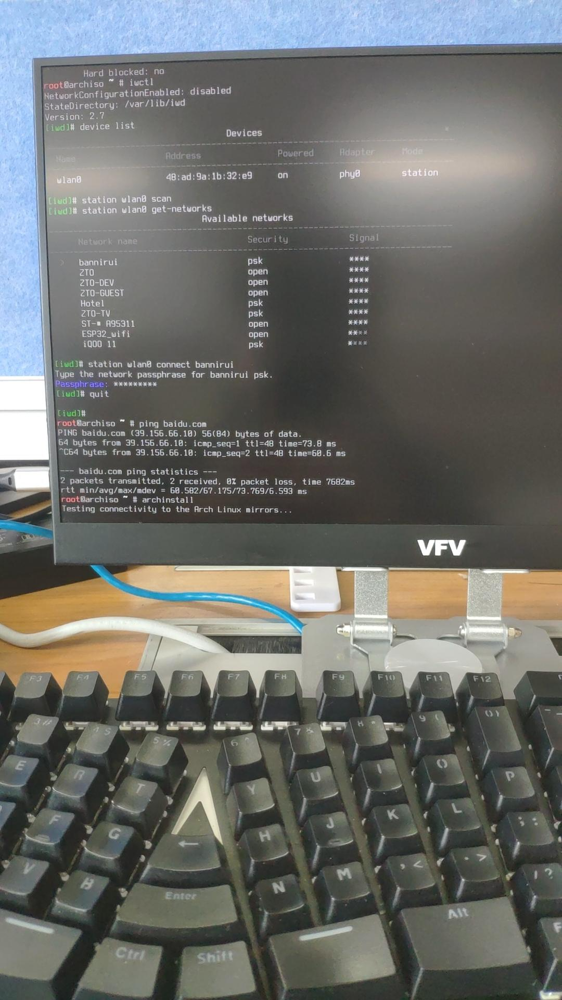

##### 3.1.6 archinstall

archinstall内置在了系统镜像中，通过该脚本大大降低了系统安装的复杂性

```shell
archinstall
```


##### 3.1.7 reboot

* 退出archinstall脚本安装模式

  ```shell
  exit
  ```

* 拔启动引导盘

* 重启系统

  ```shell
  reboot
  ```

##### 3.1.8 archlinux desk


#### 3.2 系统美化

[参考博客](https://arch.icekylin.online/guide/advanced/beauty-1.html)

#### 3.3 Archlinux Software

##### 3.3.1 编程环境

通过git的私人仓库os-script脚本配置

- vim
- zsh
- maven
- git
- ideavim
- codestyle

##### 3.3.2 中文输入法

###### 3.3.2.1 install

```shell
sudo pacman -Syu fcitx5-im
sudo pacman -S fcitx5-chinese-addons
```

###### 3.3.2.2 path

```shell
# ~.zshrc
export INPUT_METHOD=fcitx5
export GTK_IM_MODULE=fcitx5
export QT_IM_MODULE=fcitx5
export XMODIFIERS=@im=fcitx5
```

###### 3.3.2.3 系统设置


###### 3.3.2.4 输入法添加

列表中输入法顺序就是切换顺序，顺位第一个输入法就是系统启动后的默认输入法。当前管理界面没有上移\下移的操作，因此要切换默认输入法的方式是先移除，然后按照需要的顺序添加。

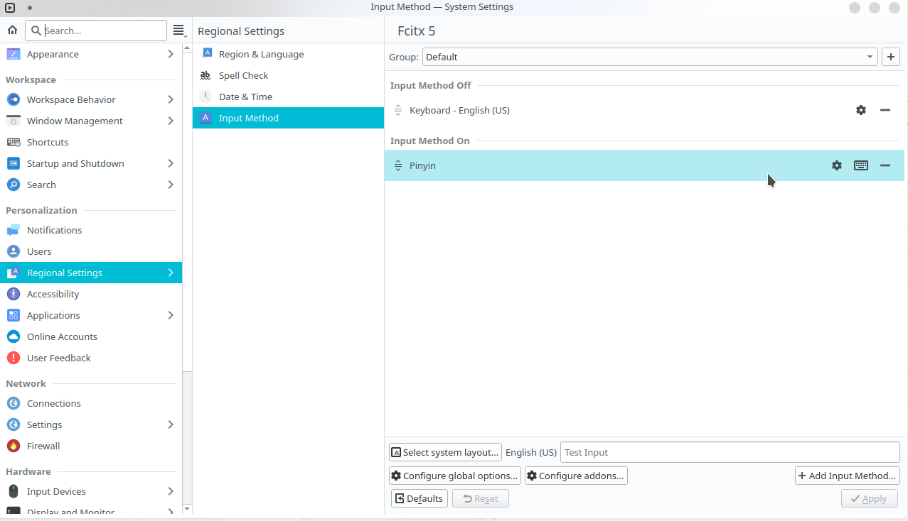

###### 3.3.2.5 系统自启动


##### 3.3.3 截图

flameshot

###### 3.3.3.1 install

```shell
sudo pacman -S flameshot
```

###### 3.3.3.2 开机启动项


###### 3.3.3.3 快捷键

自定义截图快捷键


##### 3.3.4 yay

```shell
sudo pacman -S git
sudo git clone https://aur.archlinux.org/yay-git.git
cd yay-git
makepkg -si

yay --version
```

##### 3.3.5 百度网盘

- 安装

```shell
cd  /home/dingrui/Documents/software/baidu-disk
cp ~/Downloads/baidunetdisk_4.17.7_amd64.deb ./
sudo debtap baidunetdisk_4.17.7_amd64.deb
sudo pacman -U baidunetdisk-4.17.7-1-x86_64.pkg.tar.zst
```

- 卸载

```shell
dkpg -l
sudo dpkg -P baidunetdisk
```

##### 3.3.6 chrome

- 安装

```shell
yay -Ss google-chrome
yay -S google-chrome
```

- 卸载

```shell
pacman -Q google-chrome
sudo pacman -R google-chrome
```

##### 3.3.7 kicad

```shell
pacman -Ss kicad
sudo pacman -S kicad
```

##### 3.3.8 office

```shell
yay -Ss openoffice
yay -S openoffice-bin
```

