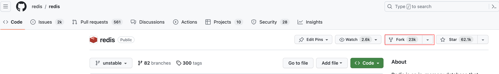
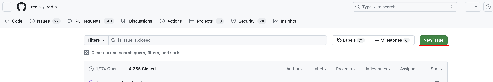
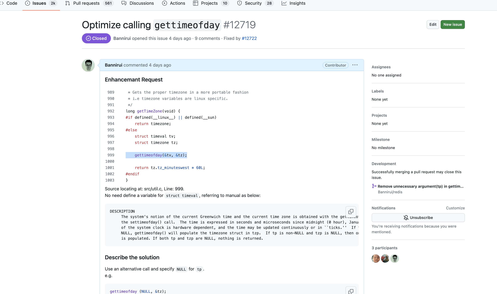
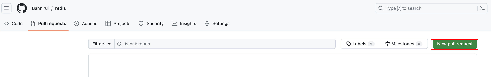
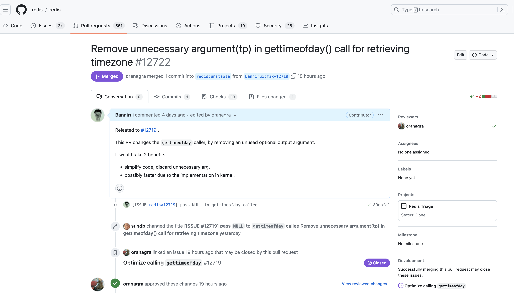

虽然不同的开源项目有不同的Contribute的规范和要求，但是总体而言都是差不多的。最近再看redis源码，刚好提交了一次PR，在此记录一下整个流程。

1 fork项目
---

首先将自己感兴趣的项目fork到自己的github仓库。




2 clone本地
---

将自己github仓库的源码克隆到本地，并设置一下分支。

```shell
git clone git@github.com:Bannirui/redis.git
cd redis
git remote add upstream https://github.com/redis/redis.git
git remote set-url --push upstream no_push
git fetch upstream
git rebase upstream/unstable
```

3 issue提交
---

提交一个issue，一般项目都会有issue模板，按照要求填写信息即可。
内容尽可能做到详尽，让人能够了解上下文信息。





4 code
---

随后就是新切一个分支进行开发，然后将其提交并push到自己仓库的远程。

```shell
git fetch upstream
git checkout unstable
git rebase upstream/unstable
git checkout -b fix-12719
git add .
git commit -m '[ISSUE #12719] pass NULL to gettimeofday callee'
git pull
git push origin fix-12719
```

5 PR
---

此时到可以在自己仓库看到黄色提示按钮或者点击Pull requests按钮。
跟issue的提交内容差不多，也是尽量格式简单，内容详尽。




6 review
---

之后就是大佬们会根据PR进行review，这是一个宝贵的交流和学习的机会。如果通过了审核，后面我们基本不用操作，都是reviewer在操作或者github的自动CI流程。
