主力机mbp实然之间坏了，记录一下常用软件的安装。

### 1 MacOS

#### 1.1 Chrome

https://www.google.com/chrome/

#### 1.2 Clashx

https://github.com/yichengchen/clashX/releases

#### 1.3 Typora

#### 1.4 Snap

#### 1.5 XBows键盘映射

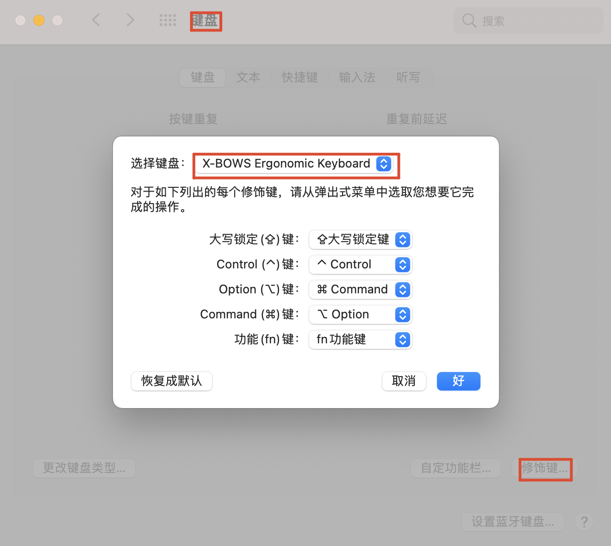

#### 1.6 IDE

https://www.jetbrains.com/toolbox-app/

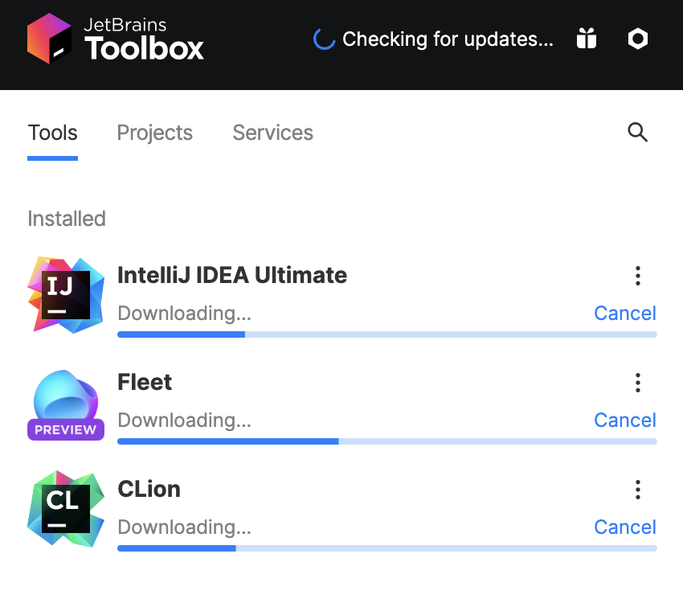

#### 1.7 xcode

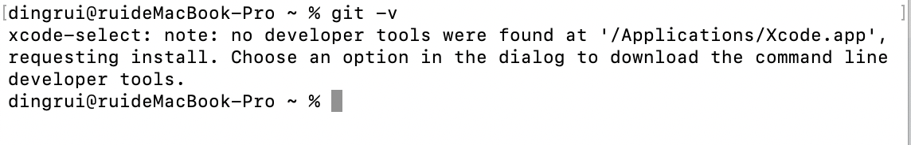

#### 1.8 启动台设置

自定义

```shell
defaults write com.apple.dock springboard-columns -int 9

defaults write com.apple.dock springboard-rows -int 6

defaults write com.apple.dock ResetLaunchPad -bool TRUE

killall Dock
```


恢复默认

```shell
defaults write com.apple.dock springboard-rows Default

defaults write com.apple.dock springboard-columns Default

defaults write com.apple.dock ResetLaunchPad -bool TRUE

killall Dock
```

#### 1.9 Homebrew

##### 1.9.1 install

```shell
/bin/bash -c "$(curl -fsSL https://raw.githubusercontent.com/Homebrew/install/HEAD/install.sh)"
```

##### 1.9.2 check


#### 1.10 iterm2

##### 1.10.1 install

```shell
brew install iterm2
```

##### 1.10.2 icon


##### 1.10.3 size

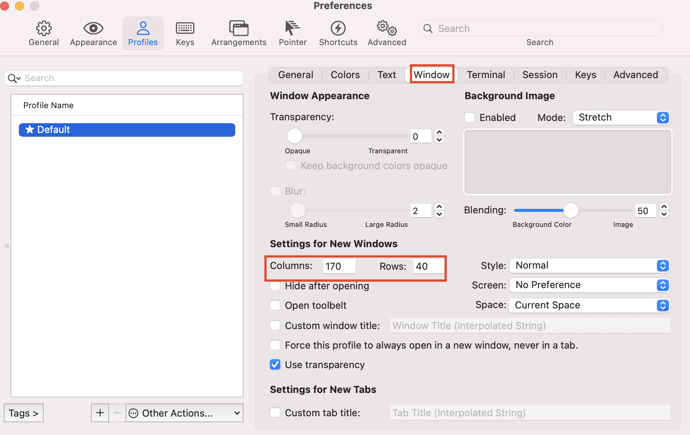

##### 1.10.4 font


#### 1.11 oh my zsh

```shell
sh -c "$(curl -fsSL https://raw.github.com/robbyrussell/oh-my-zsh/master/tools/install.sh)"
```

#### 1.12 git

##### 1.12.1 global settings

```shell
git config --global --unset user.name

git config --global --unset user.email
```

##### 1.12.2 密钥

```shell
ssh-keygen -t rsa -C "my-github"

ssh-keygen -t rsa -C "zto-gitee"
```

##### 1.12.3 信任列表

```shell
ssh-add my-github

ssh-add zto-gitee
```

##### 1.12.4 添加公钥到git账户

```shell
pbcopy < my-github.pub

pbcopy < zto-gitee.pub
```

##### 1.12.5 ssh-key

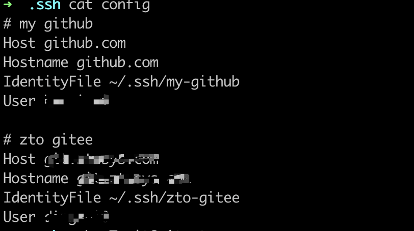

##### 1.12.6 check

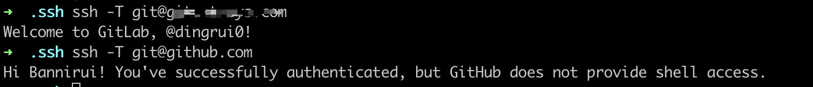

#### 1.13 hexo



### 2 Ubuntu

#### 2.1 keyboard mapping

```shell
cd /usr/share/X11/xkb/keycodes/

sudo cp evdev evdev.bak
```

将<LALT>和<LCTL>的值互换，然后保存，注销重启。

#### 2.2 clash

##### 2.2.1 download

https://v2rayse.com/client/#google_vignette

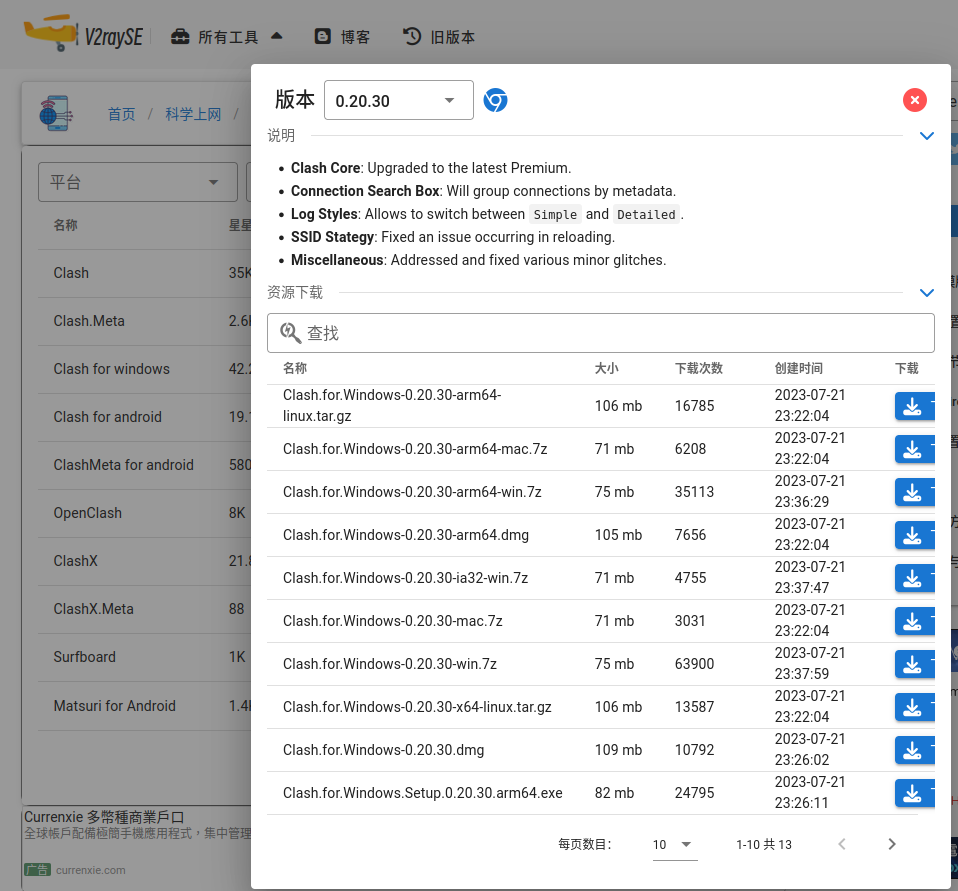

Clash.for.Windows-0.20.30-x64-linux.tar.gz

##### 2.2.2  创建文件夹

mkdir /home/Documents/softWare

##### 2.2.3 unzip

```shell
mv /home/Downloads/Clash.for.Windows-0.20.30-x64-linux.tar.gz /home/Documents/softWare

cd /home/Documents/softWare

tar -zxvf Clash.for.Windows-0.20.30-x64-linux.tar.gz

rm -rf *.gz

mv Clash.for.Windows-0.20.30-x64-linux clash
```

##### 2.2.4 icon

为其下载图片作为icon

/home/rui/Documents/softWare/clash/Clash_Logo.png

##### 2.2.4 制作桌面启动器

```shell
/home/rui/.local/share/applications

vi clash.desktop
```


内容如下

```shell
[Desktop Entry]
Name=clash for windows
Icon=/home/rui/Documents/softWare/clash/Clash_Logo.png
Exec=/home/rui/Documents/softWare/clash/cfw
Type=Application
```


权限

```shell
chmod +x clash.desktop
```

##### 2.2.5 App

添加到Dock栏
显示应用程序-添加到收藏夹


##### 2.2.6 Dock


#### 2.3 Typora

现在Typora已经开始收费，因此安装免费版本

```shell
cd /home/rui/Downloads

wget https://file.babudiu.com/f/yXCL/Typora_Linux_0.11.18_amd64.deb

sudo dpkg -i Typora_Linux_0.11.18_amd64.deb
```

#### 2.4 ~~公司软件~~

为了连接wifi，需要安装一个AppImage文件

##### 2.4.1 download

/home/rui/Documents/softWare/baohe/box.linux.8.22.9.19.AppImage

```shell
mv ~/Downloads/box.linux.8.22.9.19.AppImage ~/Documents/softWare/baohe
cd Documents/softWare/baohe
chmod +x box.linux.8.22.9.19.AppImage
```

##### 2.4.2 Dock

```shell
cd /home/rui/.local/share/applications

vi baohe.desktop
```

内容如下

```shell
[Desktop Entry]
Name=baohe
Icon=/home/rui/Documents/softWare/baohe/baohe_logo.png
Exec=/home/rui/Documents/softWare/baohe/box.linux.8.22.9.19.AppImage
Type=Application
```


可能需要安培FUSE

```shell
sudo add-apt-repository universe
sudo apt install libfuse2
```


权限

```shell
chmod +x baohe.desktop
```

##### 2.4.3 App


##### 2.4.4 uninstall

```shell
rm -rf /home/rui/.local/share/applications/baohe.desktop
rm -rf /home/rui/Documents/softWare/baohe
```

#### 2.5 git

```shell
sudo apt update
sudp apt install git
git --version
```

同上文一样配置

#### 2.6 终端

##### 2.6.1 terminator

###### 2.6.1.1 install

```shell
sudo add-apt-repository ppa:gnome-terminator
sudo apt update
sudo apt install terminator
```

###### 2.6.1.2 设置为默认终端

```shell
gsettings set org.gnome.desktop.default-applications.terminal exec /usr/bin/terminator
gsettings set org.gnome.desktop.default-applications.terminal exec-arg "-x"
```


若想要设置回去

```shell
gsettings reset org.gnome.desktop.default-applications.terminal exec
gsettings reset org.gnome.desktop.default-applications.terminal exec-arg
```

###### 2.6.1.3 配置

编辑区右键-配置文件首选项


2.6.1.3.1 字体


2.6.1.3.2 颜色

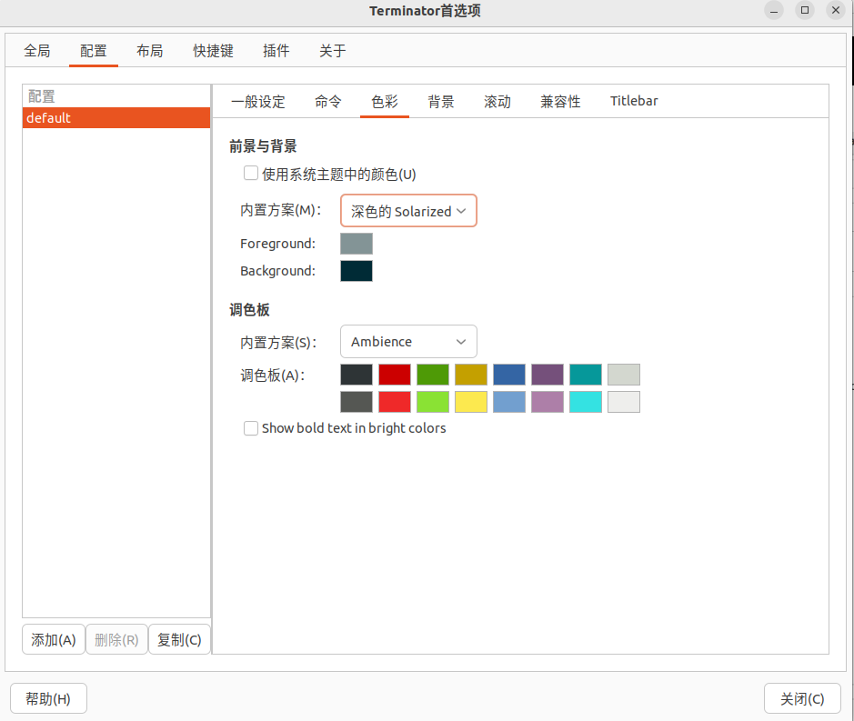

##### 2.6.2 zsh

###### 2.6.2.1 install

```shell
cat /etc/shells 
```

文件内容中没有zsh，则需要安装

```shell
sudo apt update
sudo apt install zsh -y
```

zsh as system default shell

```shell
sudo chsh -s /bin/zsh
```

###### 2.6.2.2 setting

```shell
sudo apt install curl

sh -c "$(curl -fsSL https://raw.github.com/ohmyzsh/ohmyzsh/master/tools/install.sh)"

sudo apt install powerline fonts-powerline
```


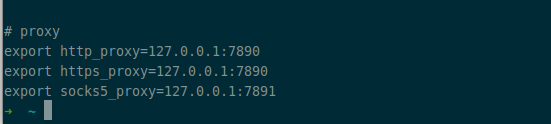

```shell
cd ~/.oh-my-zsh/themes
wget https://raw.githubusercontent.com/zakaziko99/agnosterzak-ohmyzsh-theme/master/agnosterzak.zsh-theme
```

#### 2.7 IDE

https://www.jetbrains.com/toolbox-app/


```shell
mkdir /home/rui/Documents/softWare/jb
cd /home/rui/Documents/softWare/jb
mv ~/Downloads/jetbrains-toolbox-1.28.1.15219.tar.gz ./
tar -zxvf jetbrains-toolbox-1.28.1.15219.tar.gz 
rm -rf *.gz
cd jetbrains-toolbox-1.28.1.15219
./jetbrains-toolbox
```

##### 2.7.1 settings


##### 2.7.2 maven settings

配置2个settings.xml，一个给公司项目，一个给自己项目。

##### 2.7.3 jdk

```shell
apt-cache search openjdk
sudo apt install openjdk-8-jdk
sudo apt install openjdk-18-jdk

sudo update-alternatives --config java
```

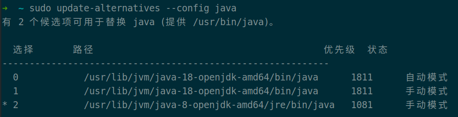

##### 2.7.4 shortcuts

###### 2.7.4.1 settings

Command+,


###### 2.7.4.2 ~~project structure~~

Command+;


###### 2.7.4.3 close tab

Command+w

2.7.4.3.1 keymap


2.7.4.3.2 vim conflicts

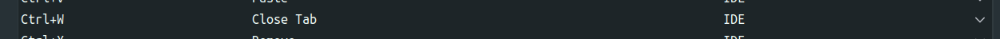

###### 2.7.4.4 project tool

Command+1


###### 2.7.4.5 IDEA and Vim

conflicts between IDEA and Vim


###### 2.7.4.6 generate code

Command+N

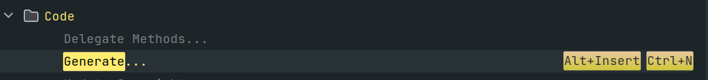

##### 2.7.5 vim

```shell
inoremap jk <ESC>

set number
set cursorline
syntax enable
set nu
set relativenumber
set tabstop=4
set softtabstop=4
set shiftwidth=4
set expandtab

let mapleader = ","

noremap <leader>re :action RenameElement<CR>
noremap <leader>rf :action ReformatCode<CR>
noremap gd :action GotoDeclaration<CR>
noremap gi :action GotoImplementation<CR>

nnoremap <C-[> :action Back<CR>
nnoremap <C-]> :action Forward<CR>
```

##### 2.7.6 make

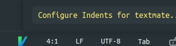

##### 2.7.7 code style



下载的.xml文件根据自已需求更改。

#### ~~2.8 magic pad~~

##### 2.8.1 touchegg

```shell
sudo add-apt-repository ppa:touchegg/stable
sudo apt update
sudo apt install touchegg
```

安装好后执行touchegg命令，然后重启，会自动启动。

##### 2.8.2 touche

```shell
cd ~/Downloads
wget https://github.com/JoseExposito/touche/releases/download/1.0.7/touche_1.0.7_amd64.deb
sudo dpkg -i touche_1.0.7_amd64.deb
```

可能报错

```shell
sudo apt-get -f install
sudo dpkg -i touche_1.0.7_amd64.deb
```

重启后在应用列表中可以看到touche

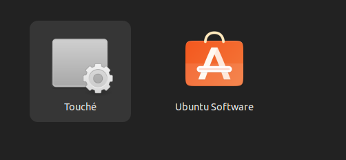

##### 2.8.3 uninstall

It is not very good

```shell
sudo apt-get remove touchegg
sudo apt-get remove touche

sudo apt-get autoremove
```

#### 2.9 screenshots

bind keymap to F1

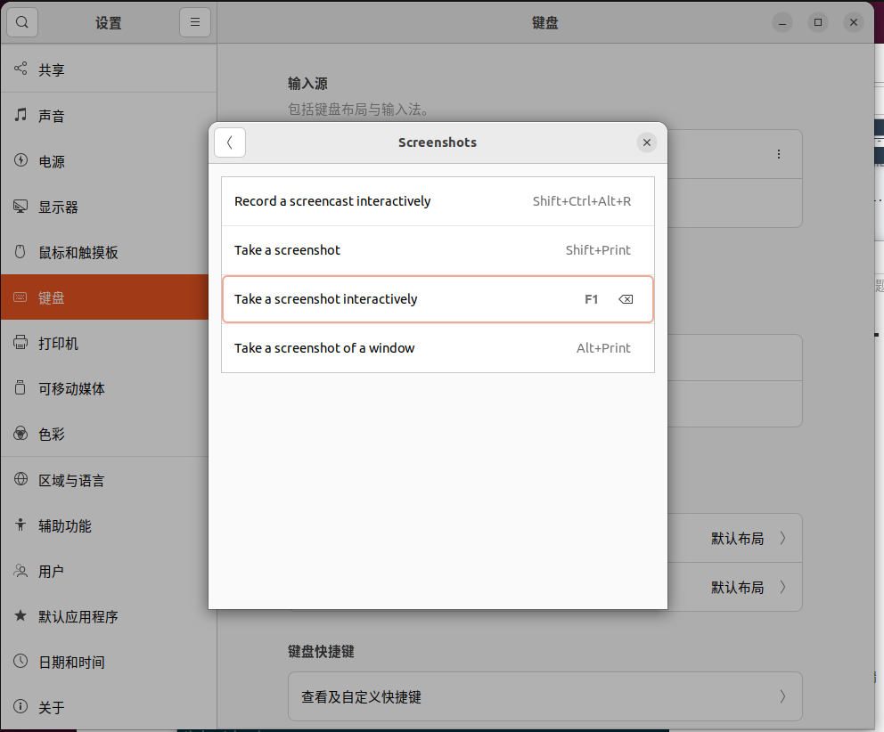

#### 2.10 Clion

##### 2.10.1 nasm

```shell
sudo apt-cache search nasm

sudo apt install nasm

nasm -v
```

##### 2.10.2 python

```shell
python3 --version

whereis python3

cd /usr/local/bin

sudo ln -s ../../bin/python3 python

ptyhon --version
```

##### 2.10.3 pip

```shell
apt-cache search python3-pip

sudo apt update

sudo apt install python3-pip

pip --version
```

##### 2.10.4 openocd

```shell
apt-cache search openocd

sudo apt update

sudo apt install openocd

openocd -v

dpgk -L openocd
```


##### 2.10.5 arm-none-eabi-gcc

```shell
dkpg -L arm-none-eabi-gcc

apt-cache search arm-none-eabi-gcc
apt-cache search gcc-arm-none-eabi

sudo apt update
sudo apt install gcc-arm-none-eabi

arm-none-eabi-gcc -v
```

##### 2.10.6 toolchain

```shell
whereis make
whereis arm-none-eabi-gcc
whereis arm-none-eabi-g++
```

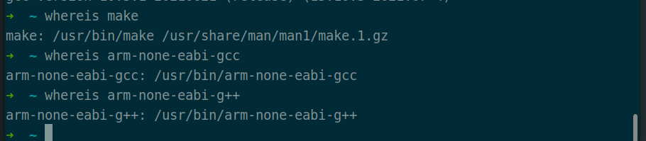


##### 2.10.7 cmake

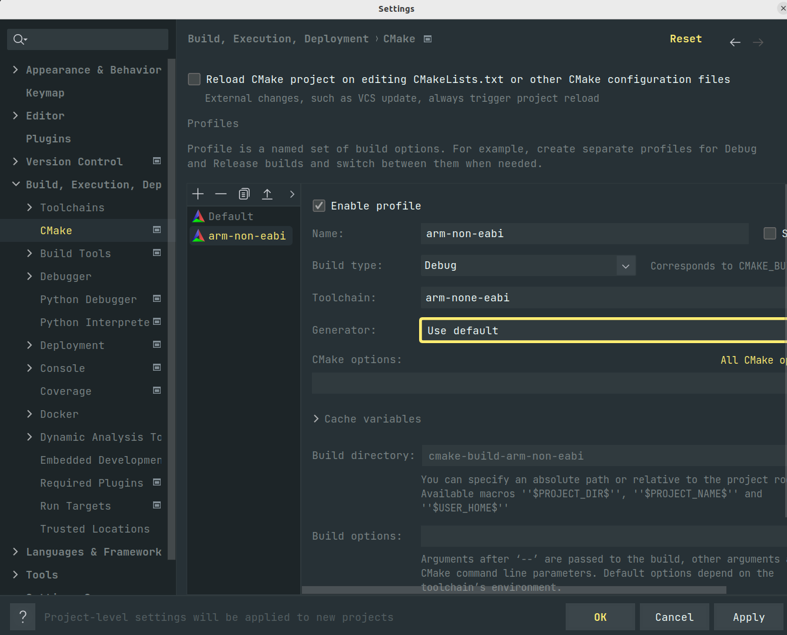

##### 2.10.8 STM32CubeMX

###### 2.10.8.1 download

https://www.st.com/en/development-tools/stm32cubemx.html#get-software

###### 2.10.8.2 install

```shell
cd Documents/softWare
mkdir -p stm && cd stm
cp ~/Downloads/en.stm32cubemx-lin-v6-9-1.zip ./
unzip en.stm32cubemx-lin-v6-9-1.zip
rm -rf *.zip
./SetupSTM32CubeMX-6.9.1
```


then click button or specify path as you want


###### 2.10.8.3 make a dock

* execute path

  

* logo

  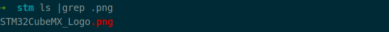

* desktop

  ```shell
  cd /home/rui/.local/share/applications
  cp clash.desktop stm32cubemx.desktop
  ```

  

* add to favorites

  

* settings

  

#### 2.11 vim

~/.vimrc

##### 2.11.1 `source` warning or error


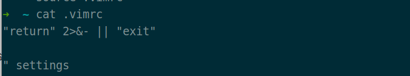

##### 2.11.2 vimrc

```shell
"return" 2>&- || "exit"

let mapleader=","

" --plugin--
set rtp+=~/.vim/bundle/Vundle.vim
call vundle#begin()

" YouCompleteMe
set runtimepath+=~/.vim/bundle/YouCompleteMe
autocmd InsertLeave * if pumvisible() == 0|pclose|endif
let g:ycm_collect_identifiers_from_tags_riles = 1
let g:ycm_collect_identifiers_from_comments_and_strings = 1
let g:syntastic_ignore_files=[".*\.py$"]
let g:ycm_seed_identifiers_with_syntax = 1
let g:ycm_complete_in_comments = 1
let g:ycm_confirm_extra_conf = 0
let g:ycm_key_list_select_completion = ['<c-n>', '<Down>']
let g:ycm_key_list_previous_completion = ['<c-p>', '<Up>']
let g:ycm_complete_in_comments = 1
let g:ycm_complete_in_strings = 1
let g:ycm_collect_identifiers_from_comments_and_strings = 1
let g:ycm_global_ycm_extra_conf='~/.vim/bundle/YouCompleteMe/third_party/ycmd/cpp/ycm/.ycm_extra_conf.py'
let g:ycm_show_diagnostics_ui = 0
inoremap <expr> <CR> pumvisible() ? "\<C-y>" : "\<CR>"
nnoremap <c-j> :YcmCompleter GoToDefinitionElseDeclaration<CR>
let g:ycm_min_num_of_chars_for_completion=2
" YouCompleteMe

Plugin 'VundleVim/Vundle.vim'

Plugin 'vim-airline/vim-airline'
" vim-airline
set t_Co=256
let g:airline_powerline_fonts = 1
let g:airline#extensions#tabline#enabled = 1
let g:airline#extensions#tabline#left_sep = ' '
let g:airline#extensions#tabline#left_alt_sep = ' '
let g:airline#extensions#tabline#buffer_nr_show = 1
nnoremap [b :bp<CR>
nnoremap ]b :bn<CR>
map <leader>1 :b 1<CR>
map <leader>2 :b 2<CR>
map <leader>3 :b 3<CR>
map <leader>4 :b 4<CR>
map <leader>5 :b 5<CR>
map <leader>6 :b 6<CR>
map <leader>7 :b 7<CR>
map <leader>8 :b 8<CR>
map <leader>9 :b 9<CR>
" vim-airline

" vim-scripts
Plugin 'taglist.vim'
map <F3> :TlistToggle<CR>
let Tlist_Use_Right_Window = 1
let Tlist_Show_One_File = 1
let Tlist_Exit_OnlyWindow = 1
let Tlist_WinWidt = 25
" vim-scripts

" NERDTree
Plugin 'The-NERD-tree'
map <F2> :NERDTreeToggle<CR>
let NERDTreeWinSize = 25
" NERDTree

Plugin 'indentLine.vim'
Plugin 'delimitMate.vim'

Plugin 'ferrine/md-img-paste.vim'
autocmd FileType markdown nmap <buffer><silent> <leader>i :call mdip#MarkdownClipboardImage()<CR>
let g:mdip_imgdir = '.'

Plugin 'godlygeek/tabular'
Plugin 'plasticboy/vim-markdown'
":help vim-markdown
":Toc

Plugin 'mzlogin/vim-markdown-toc'
":GentocMarked
":UpdateToc
let g:vmt_auto_update_on_save = 0

Plugin 'iamcco/markdown-preview.vim'
":MarkdownPreview
let mkdp_markdown_css_css=''

call vundle#end()
" --plugin--

" --global--
set nocompatible
set history=1000
filetype on
filetype plugin on
filetype indent on
set autoread
""set mouse=a
set selection=exclusive
set selectmode=mouse,key
set viminfo+=!
set iskeyword+=_,$,@,%,#,-
set report=0
set fillchars=vert:\ ,stl:\ ,stlnc:\
" --global--

" --font and color--
syntax enable
set guifont=Courier_New:h18:cANSI
set cursorline
hi cursorline guibg=#00ff00
hi CursorColumn guibg=#00ff00
au BufRead,BufNewFile * setfiletype txt
" --font and color--

" --fold--
set foldenable
" manual
" indent
" expr
" syntax
" diff
" marker
set foldmethod=syntax
set foldcolumn=0
setlocal foldlevel=3
set foldclose=all
set foldlevel=100
" --fold--

" --text--
set expandtab
set tabstop=4
set shiftwidth=4
set softtabstop=4
set smarttab
set ai
set cindent
set si
set wrap
set sw=4
set gdefault
" --text--

" --ui--
set wildmenu
set ruler
set cmdheight=1
set nu
set go=
set lz
set backspace=eol,start,indent
set whichwrap+=<,>,h,l
set magic
set noerrorbells
set novisualbell
set showmatch
set mat=2
set scrolloff=3
set hlsearch
set incsearch
set ignorecase
autocmd InsertLeave * se nocul
autocmd InsertEnter * se cul
set showcmd
" --ui--

" --codec--
set encoding=utf-8
set fencs=utf-8,ucs-bom,shift-jis,gb18030,gbk,gb2312,cp936
set fileencodings=utf-8
set termencoding=utf-8
set langmenu=zh_CN.UTF-8
set helplang=cn
" --codec--

" --other--
set smartindent
set cin
set showmatch
set confirm
set guioptions-=T
set guioptions-=m
set vb t_vb=
set laststatus=2
set statusline=%F%m%r%h%w\ [FORMAT=%{&ff}]\ [TYPE=%Y]\ [POS=%l,%v][%p%%]\ %{strftime(\"%d/%m/%y\ -\ %H:%M\")}
"set pastetoggle= <F9>
set background=dark
set completeopt=longest,preview,menu
set clipboard+=unnamed
set nobackup
set noswapfile
set autowrite

if version >= 603
    set helplang=cn
    set encoding=utf-8
endif

highlight Search ctermbg=black ctermfg=white guifg=white guibg=black
" --other--

autocmd FileType c,cpp map <buffer> <leader><space> :w<cr>:make<cr>
:set makeprg=g++\ -Wall\ \ %
au BufRead,BufNewFile * setfiletype txt
:inoremap ( ()<Esc>i
:inoremap ) <c-r>=ClosePair(')')<CR>
:inoremap [ []<ESC>i
:inoremap ] <c-r>=ClosePair(']')<CR>
:inoremap " ""<ESC>i
:inoremap ' ''<ESC>i

function! ClosePair(char)
    if getline('.)[col('.' - 1] == a:char
        return "\<Right>"
    else
        return a:char
endfunction

" --keymap--
inoremap jk <ESC>
map <C-A> ggVGY
map! <C-A> <Esc>ggVGAY
vmap <C-c> "+y
" --keymap--

" --script--
autocmd BufNewFile *.py,*.cc,*.sh,*.java exec ":call SetTitle()"

func SetTitle()
    if expand ("%:e") == 'sh'
        call setline(1, "#!/bin/bash")
        call setline(2, "#Author: dingrui")
        call setline(3, "#Time:".strftime("%F %T"))
        call setline(4, "#Name:".expand("%"))
        call setline(5, "#Version:V1.0")
        call setline(6, "#Description:This is a protuction script.")
        autocmd BufNewFile * normal G
endfunc
" --script--

" --command--
"  :PluginList
"  :PluginInstall
"  :PluginSearch {plugin-name}
"  :PluginCLean
" --command--
```

##### 2.11.3 plugin

###### 2.11.3.1 Vundle

```shell
mkdir .vim
cd .vim
mkdir bundle

git clone https://github.com/VundleVim/Vundle.vim.git ~/.vim/bundle/Vundle.vim
```

###### 2.11.3.2 ctags

```shell
sudo apt update
apt-cache search ctags

sudo apt install universal-ctags

dpkg -l |grep -i ctags
```

##### 2.11.4 python

```shell
cd .vim
git clone https://github.com/rkulla/pydiction.git

mkdir -p tools/pydiction
cp -r pydiction/after ./
cp pydiction/complete-dict ./tools/pydiction 

rm -rf pydiction
```


.vimrc

```shell
filetype plugin on

let g:pydiction_location='/home/rui/.vim/tools/pydiction/complete-dict'     
let g:pydiction_menu_height = 20
```


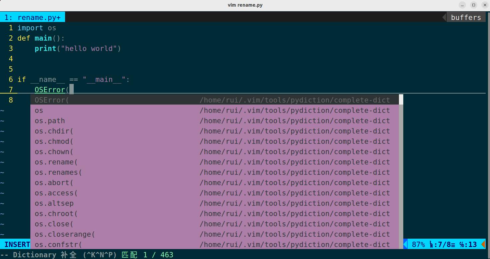

#### 2.12 xclip

```shell
apt-cache search xclip
sudo apt update
sudo apt install xclip
```

#### 2.13 yt-dlp

```shell
pip install yt-dlp
yt-dlp --version

sudo apt update
apt-cache search ffmpeg
sudo apt install ffmpeg

yt-dlp https://www.bilibili.com/video/BV1zy4y1b7jZ/\?spm_id_from\=333.999.0.0\&vd_source\=4f8115abf6e07772d02db76f3b552dba --proxy socks5://127.0.0.1:7890 -F

yt-dlp https://www.bilibili.com/video/BV1zy4y1b7jZ/\?spm_id_from\=333.999.0.0\&vd_source\=4f8115abf6e07772d02db76f3b552dba --proxy socks5://127.0.0.1:7890
```

#### 2.14 KiCad

```bash
sudo add-apt-repository ppa:kicad/kicad-7.0-releases
sudo apt update
sudo apt install kicad
```

