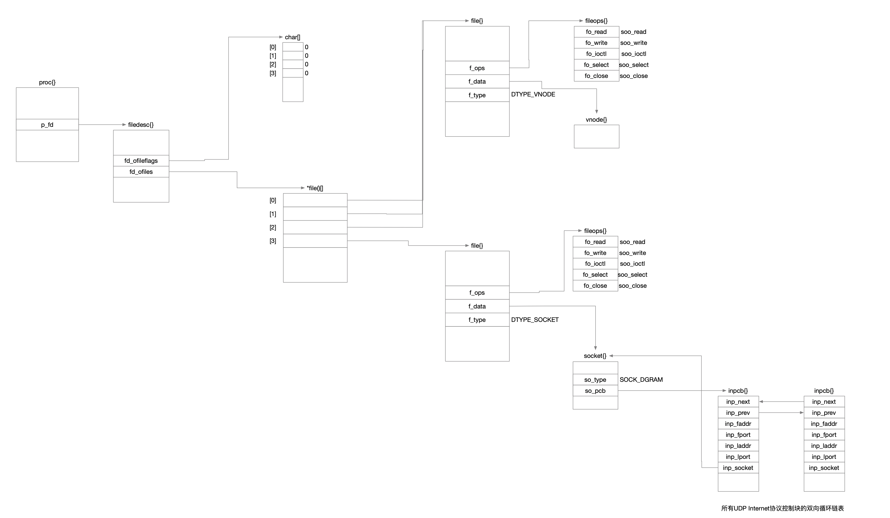

## TCP\IP详解卷1

### 1 重传

一个直接处理分组丢失和比特差错的方法是重发分组直到它被正确接收

那么就需要一种方法来判断

* 接收方是否已经收到分组
* 接收方接收到到的分组是否与之前发送方发送的是一样的
  * 接收方给发送方发送信号以确定自己已经接收到了一个分组，这种方法被称为确认，即ACK
    * 发送方发送一个分组，然后等待一个ACK
    * 当接收方接收到这个分组时，它发送对应的ACK
    * 当发送方接收到这个ACK，它再发送另一个分组
  * 这个衍生3个问题
    * 发送方对一个ACK应该等待多长时间
    * 如果ACK丢失了怎么办
    * 如果分组被接收到了，但是里面有错怎么办

#### 1.1 发送方对ACK应该等待多长时间

发送方决定去等待多长时间与发送方期待为一个ACK等待多长时间有关

#### 1.2 如果ACK丢失了怎么办

如果一个ACK丢了，从接收方视角来看

* ACK丢了，接收方接收不到ACK信息
* 原分组丢了，接收方接收不到ACK信息

即，发送方并不能轻易地把ACK丢了这种情况跟原分组丢失的情况区分开来，因此接收方一律简单处理-再次发送原分组

这样的话，从接收方视角来看，接收方可能会接收到两个或更多的拷贝，因此接收方必须想办法处理这种情况

##### 接收方怎么处理重复分组

使用序列号处理，在被源端发送时，每个唯一的分组都有一个新的序列号，这个序列号由分组自身一直携带。接收方可以根据序列号判断自己是否已经见过这个分组，如果见过分组就直接丢弃它

#### 1.3分组被接收但是分组有错怎么办

使用简单的编码进行差错检测，不需要进行纠正差错，当接收方接收到了一个含有差错的分组时，它就不发送ACK，触发发送发的超时重发，最后，发送方重发完整的无差错的分组

### 2 分组窗口和滑动窗口

为了提高吞吐，需要允许多个分组同时进入网络，需要考虑的场景有

* 发送方
  * 不仅要决定什么时间注入一个分组到网络中，还要考虑注入多少个
  * 在等待ACK时，怎么维护计时器
  * 要保存每一个还没被确认的分组，防止需要重传
* 接收方
  * 需要准备一套ACK机制，可以区分哪些分组已经收到，哪些分组还没收到
  * 需要准备一套缓存机制，用来保存分组，因为分组的到来可能是乱序的
* 如果接收方的接收速率>发送方法发送速率，怎么办
* 如果发送方发送速率
  * 接收方可能会因为内存限制丢掉这些分组，怎么办
  * 中间的路由器也可能由于处理或者内存限制，丢掉分组，怎么办
* 网络基础设置处理不了发送方和接收方想要使用的数据发送率怎么办

#### 2.1 分组窗口

定义一个分组窗口，这个窗口作为一个集合，存放什么内容呢

哪些已经被发送方注入网络，但是发送方还没收到ACK的分组

这个分组窗口中的分组数量就称为窗口大小

#### 2.2 滑动窗口

滑动窗口结构在发送方和接收方都会定义一个

* 发送方
  * 记录着哪些分组可以被释放
  * 哪些分组正在等待ACK
  * 哪些分组还不能被发送出去
* 接收方
  * 记录着哪些分组已经被接收和确认
  * 哪些分组是下一步期望的
  * 哪些分组即使被接收也将会因为内存限制而被丢弃

#### 2.3 变量窗口

流量控制-为了处理接收方相对发送方太慢时产生的问题，在接收方跟不上时会强迫发送方慢下来

流量控制方式通常有两种

* 基于速率-给发送方指定某个速率，同时确保数据永远不能超过这个速率发送
* 基于窗口-窗口大小是不固定的，而是允许随时间而变动的

为了使用基于窗口流量控制，必须有一种方法让接收方可以通知发送方使用多大的窗口，这个动作称为窗口通告或者叫窗口更新

### 3 重传超时

如何设置发送方重传超时，也就是重传的超时时间设置多久合适

发送方在重发一个分组之前应该等待的时间量大概包括

* 发送方发送分组所用的时间
* 接收方处理分组以及发送一个ACK所用的时间
* ACK从接收方返回到发送方所用的时间
* 发送方处理ACK所用的时间

不过可惜的是，以上时间没有一个确切知道的

甚至，以上几个或者全部都会随着来自客户端主机或路由器的额外负载的增加或减少而随时发生改变

也就是说，让用户主动告诉协议，在每种情况下应该将超时时间设置为多少，这是不可能的，也不合理

因此，更高的策略是让协议自己尝试去估计超时时间

RTT=round-trip-time 往返时间

#### 3.1 RTT

传输协议选择一组RTT样本的均值作为真实的RTT，分组穿过网络的路径是可能会改变的，也就是说这个均值不是静态值，是一个跟随实际传输而改变的动态值

* 但是，直接将RTT均值直接设置成超时是不合理的，毕竟均值只是一个既定事实的统计数据
* 如果将超时时间设置得刚好等于RTT均值，很有可能导致发生不必要的分组重传
* 因此超时时间应该设置得比RTT均值要大一些
* 但是如果超时时间设置得过大，显而易见的问题是可能导致网络比较空闲，系统的吞吐率会下降
* 因此超时时间具体设置得比RTT均值大多少是个学问

#### 3.2 重传计时器

TCP发送一组报文段时，通常只设置一个重传计时器，等待接收方的ACK。

发送方不会为每个报文段都设置一个单独的重传计时器，而是发送一个窗口的数据，只设置一个重传计时器，一个窗口的分组共用一个重传计时器，每收到一个ACK就更新超时

但凡出现计时器到期，就将发送窗口内的分组都重发一遍

### 4 ACK

TCP接收到连接另一端的数据时候，它就会发送一个ACK

这个ACK可能不是立即发送，可能会延迟一个时间

TCP使用的ACK时累积的，即一个N的ACK语义是，[...N)已经被接收

这样设计的好处是，如果一个ACK丢了，很有可能后续的ACK就足够确认前面的报文段了

### 5 TCP

一个TCP连接由一个4元组构成，它们分别是两个IP地址和两个端口号

一个TCP连接是由一对端点或套接字构成，其中通信的每一端都有一对[IP，端口]所唯一标识

#### 5.1 3次握手

* 让通信双方了解一个连接正在建立
* 利用数据包的选项来承载特殊的信息，交换初始序列号

#### 5.2 半关闭

TCP的半关闭操作是指仅关闭数据流的一个传输方向，而两个半关闭操作合在一起就能够关闭整个连接

#### 5.3 TIME_WAIT

TIME_WAIT状态也称为2MSL等待状态

在该状态中，TCP将会等待两倍于最大段生存期的时间，即2个MSL的时间，因此TIME_WAIT也被称为加倍等待

每个实现都必须为最大段生存期选择一个数值，它代表的是任何报文段在被丢弃前在网络中被允许存在的最长时间

MSL这个时间是有限制的，因为TCP报文段是以IP数据报的形式在传输的，IP数据报拥有TTL字段和跳数限制字段，这两个字段共同限制了IP数据报的有效生存时间

常见的实现中，最大段生存期的数值可以是30s\1分钟\2分钟，在绝大多数情况下，这一数值是可以修改的

当TCP执行一个主动关闭并发送最终的ACK时，连接必须处于TIME_WAIT状态并持续2倍于最大生存期的时间。这样就能够让TCP重新发送最终的ACK以避免出现丢失的情况。重新发送最终的ACK不是因为TCP主动要重传ACK，因为ACK本身并不消耗序列号，重传ACK是被动重传的，因为对端重传了它的FIN，FIN会消耗一个序号。因为对端主动重传了FIN，因此收到对端FIN之后又被动重传了这个FIN对应的ACK

### 6 延时确认

在许多情况下，TCP并不对每个到来的数据包都返回ACK，利用TCP的累积ACK确认字段就能实现该功能

累积确认可以允许TCP延迟一段时间发送ACK，以便将ACK和相同方向上需要传输的数据组合发送

采用延时ACK的方法可以减少ACK传输数目，可以一定程度地减轻网络负载

### 7 Nagle算法

当一个TCP连接中有在传数据，也就是有已经发送但是还没确认的数据，那些长度小于SMSS的报文段就被定义为小的报文段，他们是不能继续被发送的，直到所有的在传数据都收到ACK

在收到ACK后，TCP需要收集这些小的数据，将他们整合到一个报文段中去发送

也就是说用小数据包的时效换取整个发送的网络利用率和吞吐率

这种方法迫使TCP遵循停等规程-只有等接收到所有在传数据的ACK后才能继续发送

这个算法的精妙之处就在于，实现了自时钟控制

* ACK返回越快，数据传输也越快
* 在相当于高延迟的广域网中，更需要减少微型报的数目
* 该算法使得单位时间内发送的报文段数目更少
* RTT控制着发包速率

### 8 TCP拥塞控制

拥塞控制是批量数据传输总最重要的

拥塞控制是TCP通信的每一方需要执行的一系列行为，这些行为由特定的算法规定，用于防止网络因为大规模的通信负载而瘫痪

有理由认为网络即将进入拥塞状态，或者已经由于拥塞而出现了路由器丢包情况，这个时候拥塞控制算法减缓TCP传输

需要克服3个难点

* TCP拥塞控制的难点在于怎么准确地判断何时需要减缓
* 怎么减缓TCP传输
* 何时恢复原有的传输速度

#### 8.1 路由器排队理论

即使路由器能够存储一些数据，但是如果源源不断的数据的到达速率是高于发出速率的，任何中间的存储都会溢出

当某一个路由器在单位时间内接收到的数据量多于其可发送的数据量时，路由器就需要把多余的数据存储起来

如果这种情况持续，最终存储砌砖就会耗尽，路由器只能开始丢弃部分数据

#### 8.2 什么叫拥塞

路由器因为无法处理高速率到达的流量而被迫丢弃数据信息的现象就叫拥塞

当路由器处于拥塞状态时，就说明出现了拥塞现象

即使仅仅只有一条通信连接，也可能造成一个甚至多个路由器拥塞，如果不采取措施，网络性能将会收到极大的影响甚至瘫痪

在最坏的情况下，形成拥塞崩溃

因此，为了避免或者缓解拥塞情况，TCP通信的每一方都实行了拥塞控制机制

#### 8.3 拥塞检测

在互联网中很难做到让TCP知晓，也就是说没有一个精确的方法知晓路由器的状态，即没有一个明确的信号告知拥塞状况已经发生

* 通常是看是否有丢包情况发生，在TCP中，丢包被用作判断拥塞发生与否的指标，用来衡量是否实施相应的响应措施
* 延时测量
* 显式拥塞通知

对于TCP而言，如果发生了丢包情况，TCP的任务是重传这些数据包

那么TCP发现有丢包现象发生后，TCP还能做什么，如何识别这些丢包现象就是表明已经出现了拥塞，进而进行减速操作

#### 8.4 TCP减缓发送

如何减缓TCP发送

根据接收方剩余缓存空间的大小，在TCP头部设置了通知窗口大小的字段，这个数值是TCP发送方调解发送速率的依据

当接收速率或者网络传输速率过慢时，就需要降低发送速率

引入一个窗口控制变量，这个变量却表发送窗口大小不超过接收端接收能力和网络传输能力，也就是TCP发送端的发送速率=min(接收速率，传输速率)

拥塞窗口cwnd反映了网络传输能力

2个核心算法，慢启动和拥塞避免，这两个算法是基于包守恒和ACK时钟原理，这两个算法不是同时运行的，在任一时刻，TCP只运行其中一个算法，但是这两个算法可以相互切换

##### 8.4.1 慢启动

慢启动的目的是什么

* 使TCP在用拥塞避免探寻更多可用带宽之前得到cwnd值

* 帮助TCP建立ACK时钟

什么时候会启用慢启动算法

* 一个新的TCP连接建立的时候
* 检测到由重传超时导致丢包时
* TCP发送端长时间处于空闲状态

##### 8.4.2 拥塞避免

为了得到更多的传输资源而不影响其他连接传输，TCP实现了拥塞避免算法

一旦确立慢启动阈值，TCP会进入拥塞避免阶段，cwnd每次的增长值近似于成功传输的数据段大小

这种随时间线性增长方式于慢启动的指数增长相比缓慢很多

### 9 TCP保活机制

TCP保活机制为了解决什么问题

* 一些情况下，客户端和服务端需要了解什么时候终止进程或者与对方断开连接
* 一些情况下，虽然应用进程之间没有任何数据交换，但仍然需要通过连接保持一个最小的数据流

TCP保活机制在一种不影响数据流内容的情况下探测对方，通过一个保活计时器实现，当计时器被激发，连接一端将发送一个保活探测报文，另一端接收报文的同时会发送一个ACK作为响应

#### 9.1 保活探测报文

保活探测报文是一个空报文段或者只包含1字节，它的序列号等于对方主机发送的ACK报文段的最大序列号减1，收到了对端ACK说明seq-1这个数据段已经被对端成功接收，所以不会对已经达到对端的报文段造成影响

探测报文段返回的响应可以确定连接是否仍在工作

探测及其响应报文段都不包含任何新的有效数据，可以看成好是垃圾数据，当他们丢失的时候也不会进行重传

#### 9.2 探测状态

TCP保活功能需要主动开启，开启功能的一端会发现对端处于以下4个状态之一

* 对端主机仍在工作，并且可以到达
* 对端主机已经崩溃，已经关闭或者正在重新启动
* 对端主机崩溃并且已经重启
* 对端主机仍在工作，但是由于某些原因不能到达请求端

请求端不用担心对端主机正常关闭然后重启这种情况。当系统关机时，所有的应用进程会终止，他们的TCP会发送一个FIN。当请求端收到FIN后，会向请求端进程报告文件结束，并在检测到该状态后退出

## TCP\IP详解卷2

### 1 系统调用

什么叫系统调用

所有操作系统都提供服务访问点，程序可以通过它们请求内核中的服务。Unix提供了有限个内核入口点。这些入口点就是系统调用

### 2 描述符

#### 2.1 描述符特性

* 可以用描述符调用read和write
* 可以用dup复制它
* 在调用fork后，父进程和子进程可以共享它
* 可以调用fcntl来改变它的属性
* 可以调用close来关闭它

#### 2.2 插口描述符

socket的返回值是一个描述符，它具有unix描述符的所有特性

### 3 系统调用过程

* 当进程执行一个系统调用，内核就会访问进程表结构

* 进程表的表项指向filedesc结构
  * fd_ofileflags 字符数组指针 每个描述符有一个描述符标志
  * fd_ofiles 指向文件表结构的指针数组的指针

#### 3.1 file{}

fd_ofiles指向的数据结构用*file{}[]来表示

* 它是指向file结构的指针数组
* 这个数组及描述符标志数组的下标就是描述符本身
* 结构file的成员f_type指示描述符的类型
  * DTYPE_SOCKET
  * DTYPE_VNODE 是一个通用机制 允许内核支持不同类型的文件系统
    * 磁盘文件系统
    * 网络文件系统
    * CD-ROM文件系统
    * 基于存储器的文件系统

### 4 mbuf

mbuf的主要用途是保存进程和网络接口间相互传递的用户数据，但mbuf也用于保存其他各种数据

* 源与目标地址
* 插口选项

常见4种类型的mbuf，它们依据在成员m_flags中填写不同的标志M_PKTHDR和M_EXT而不同

* 如果m_flags等于0，mbuf只包含数据
* m_flags的值是M_PKTHDR，它指示这是一个分组首部，描述一个分组数据的第一个mbuf
* 没有设置K_PKTHDR，不包含分组首部，但包含超过208字节的数据，这时用到一个叫做簇的外部缓存
* mbuf包含一个分组首部，并包含超过208字节的数据，同时设置了标志M_PKTHDR和M_EXT

### 5 中断级别

网络代码处理输入分组用的是异步和中断驱动的方式

一个设备中断引发接口层代码执行，然后它产生一个软中断引发协议层代码执行，当内核完成这些级别的中断后，执行插口代码

### 6 主机和路由器

在一个Internet上的系统通常能划分为两类

* 主机 一个主机通常有一个网络接口，并且是一个IP分组的源或目标方
* 路由器 一个路由器有多个网络接口，当分组向它的目标方移动时将分组从一个网络转发到下一个网络

### 7 IP

IP具有一种重要功能，就是当分组过大而不适合在所选硬件接口上发送时，能够对分组进行分片

过的分组被分成两个或多个大小适合在所选定网络上发送的IP分片

在去目的主机的路途中，分片还可能被中间的路由器继续分片

在目的主机上，一个IP数据报可能放在一个IP分组内，或者，如果在发送时被分片，就放在多个IP分组内。因为各个分片可能以不同的路径到达目的主机，所以只有目的主机才有机会看到所有分片

因此，也只有目的主机才能把所有分片重装成一个完整的数据报，提交给合适的运输层协议

#### 7.1 IP首部

IP首部内有3个字段实现分片和重装

* ip_id 标识字段
* if_off高3bit 标志字段
  * 比特0时保留位 必须为0
  * 比特1是DF不分片标志
  * 比特2是MF更多分片标志
* ip_off低13比特 偏移字段

### 8 socket结构

插口代表一条通信链路的一端，存储或指向与链路有关的所有信息

* 使用的协议
* 协议的状态信息(包括源和目的地址)
* 到达的连接队列
* 数据缓存
* 可选标志

### 9 socket系统调用

socket系统调用产生一个新的插口，并将插口同进程在参数domain、type和protocol中制定的协议联系起来

该函数分配一个新的描述符，用来在后续的系统调用中标识插口，并将描述符返回给进程

#### 9.1 参数结构

每一个系统调用的前面，都定义了一个描述进程传递给内核的参数的结构

参数是通过socket_args传入的

所有插口层系统调用都有3个参数

* p 指向调用进程的proc结构
* uap 指向包含进程传送给系统调用的参数的结构
* retval 用来接收系统调用的返回值

#### 9.2 bind

bind系统调用将一个本地的网络运输层地址和插口联系起来

作为客户的进程并不关心它的本地地址是什么，进程在通信之前并不需要调用bind，内核会自动为其选择一个本地地址

服务器进程则总是需要绑定到一个已知的地址上，进程在接收连接TCP或者接收数据报UDP之前必须调用bind，因为客户进程需要同已知的地址建立连接或者发送数据报到已知的地址

#### 9.3 listen

listen系统调用的功能是通知协议进程准备接收插口上的连接请求

它同时也指定插口上可以排队等待的连接数的门限值

超过门限值时，插口层将拒绝进入的连接请求排队等待，在这种情况出现时，TCP将忽略进入的连接请求

#### 9.4 accept

调用listen后，进程调用accept等待连接请求

accept返回一个新的描述符，指向一个连接到客户端的新的插口，原来的插口仍然是未连接的，并准备接收下一个连接

处理连接的细节由与插口相关联的协议来完成，对于TCP而言，当一条连接已经被建立，也就是完成了三次握手，就通知插口层

## TCP\IP详解卷3

### 1 TAO

T/TCP的核心是TAO，即TCP加速打开，这项技术使得T/TCP服务器收到T/TCP客户的SYN报文段后能够知道这个SYN是新的，从而可以跳过三次握手

确保服务器所收SYN是新SYN的技术就是TAO测试，这个技术是为主机已经建立的每个连接分配一个唯一的标识符，这个标识符是连接记数CC

每个T/TCP主机都要把与每一个对等主机之间最新连接的CC值保留一段时间

如果所收SYN报文段的CC值大于从对等主机接收的最新CC值，那么TAO测试成功

### 2 TIME_WAIT

设置TIME_WAIT状态的原因有两个

* 实现了全双工的连接关闭
* 使过时的重复报文作废

#### 2.1 TCP全双工关闭

TIME_WAIT状态出现在执行主动关闭的一端，该端发出最后一个ACK报文段，如果这个ACK丢失或者对端最后一个FIN丢失，那么结果就是对端因为重传超时内没收到ACK，所以会重发一次FIN报文段。 因此，在主动关闭的一端保留连接的状态信息，这样它才能在需要的时候重传最后的确认报文段

否则，它收到最后的FIN报文段后就无法重传最后的一个ACK，而只能发出RST报文段，从而造成虚假的错误信息

#### 2.2 让过时的重复报文段时效

TCP协议的运行基于一个基本的假设：互联网上的每一个IP数据报都有一个有限的生命期限，这个期限值是由IP首部的TTL(生存时间)字段去决定的。每一台路由器在转发IP数据报时都要将其TTL值减1

但如果该IP数据报在路由器中等待的时间超过1s，那就要把TTL的值减去等待的时间

实际上，很少有IP数据报在路由器中等待的时间超过1s，因而每个路由器通常把TTL的值减1

由于TTL字段的长度是8bit，因此每个IP数据报所能经历的转发次数至多255

